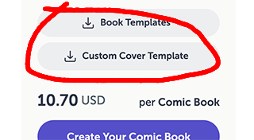
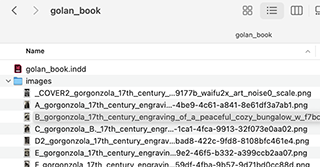
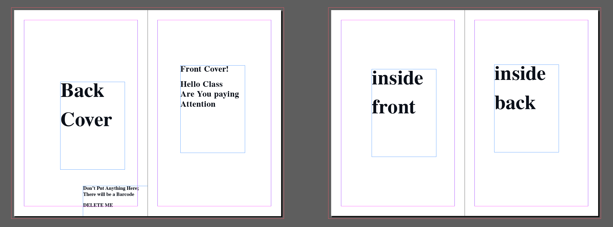

# Instructions for Making Your Monographs

**Contents**: 

* [Steps for Working with the Lulu.com *Interior* Template](#steps-for-working-with-the-lulucom-interior-template)
* [Working with the *Cover* Template](#working-with-the-cover-template)
* [Publishing on Lulu.com](#publishing-on-lulucom)
* [Wrapping Up](#wrapping-up)

---

## Steps for Working with the Lulu.com *Interior* Template

1. On your laptop, with a wide browser window open, navigate to **[https://www.lulu.com/pricing](https://www.lulu.com/pricing)**. 
2. Select "Comic Book" (6.625"x10.25"): 
3. For "Book Size & Page Count", enter a number between **4-30**. *(You can change this later as long as it's in this range.)*
4. For "Binding Type", choose **Saddle Stitch**.
5. For "Interior Color", choose **Premium Color** (unless you want B&W). 
6. For "Paper Type", choose **White — 70# Coated**.
7. For "Cover Finish", I recommend **Glossy** (unless you're certain you want Matte).
8. At this point you can now **download your book template**.  Scroll to the bottom of the page and click "Book Templates" and "Custom Cover Template":  This will cause the following files to download: 
  * `cover_template.pdf`
  * `lulu-book-template-comic-book.zip`
  * Later on, Here is a [revised cover template](resources/2026/lulu-comic-book-saddle-stitch-cover-template.indd.zip) (2024) that may be helpful when you lay out the cover. 
9. **Unzip** (uncompress) the `lulu-book-template-comic-book.zip` archive, probably by double-clicking on it. You'll get a folder called `lulu-book-template-comic-book`. 
10. Inside, **locate** the Adobe InDesign (.indd) file: `Interior Templates/InDesign Spreads/lulu-comic-interior-template-spread.indd`. This is your template file. 
11. **Create** a new folder called `myname_book` or something similar. **Make a copy** of the `.indd` InDesign template file, **place** it in this folder, and **rename** it to something like `myname_book.indd`.
12. Inside your `myname_book` folder, **create** another folder called `images`, and **drag** all of your image assets in there. It should look something like this: . 
13. **Open** your `myname_book.indd` file in InDesign. We will now start editing it. I'm using AdobeIndesign 2026 (v.21.1).
15. I recommend you **enable** `View > Guides & Grids > Show Document Grid` and `Snap to Document Grid`.
16. Begin by **editing** your main page Parents. At the top of your Pages palette, **locate** the `PG-Page` Parent. **Modify** this page as you see fit. Changes you make will show up in all pages that use this page Parent. For example, I like to to add some guides, a text box, and an image Frame.
16. **Navigate** to one of your pages, and **drag** in an image. You can resize your image by holding down *Shift*. If it looks cropped, don't worry; you can fix this by right-clicking on the image and selecting `Fitting > Fit Content to Frame`.
17. If you'd like to add text to a text-box that is defined in a page Parent, you can do so with `Cmd + Shift + Click` (mac) or `Ctrl + Shift + Click` (win).
17. To add pages using the Pages menu, **go** to the Pages palette, **open** the tiny Options hamburger menu in the upper right, and **click** "Insert Pages".
17. If you use *full bleed* on your book (i.e., when you want ink to go all the way to the edges), make sure that your design goes *past* the edge of the page, and make sure you set a Bleed of 0.125 when you export the file. Otherwise, Lulu may complain that your document is the wrong size, or you might see white edges on your pages.
18. **Note** that you will export the interior and exterior of your book as separate PDF files! 
19. Before exporting your print-ready PDFs, **go** to the Layers palette and **delete** the Template Guides and Notes layers.
20. **Export** your book's ***interior*** as a *single, multi-page PDF (not spreads!) with bleed.*

---

## Working with the *Cover* Template

*Eventually you will have 2 PDFs that get uploaded to Lulu.com: an interior PDF, and a cover PDF. The cover requires a separate workflow from the interior of your book.*

1. Instead of using Lulu's cover template PDF (which doesn't load cleanly into InDesign), I recommend instead using this [**simpler cover template we have prepared just for you**](resources/2026/lulu-comic-book-saddle-stitch-cover-template.indd.zip) (`lulu-comic-book-saddle-stitch-cover-template.indd.zip`). **Download** and **unzip** this `.indd` file, **make** a clean backup copy if you like, and **open** it in InDesign. 
2. **Design** your cover! **Consider** making attractive [endpapers](https://en.wikipedia.org/wiki/Endpaper) (also called *end leaves*) which are thematically related to your book's content.
3. When it's time to export your book's *cover*, **make sure** you have [Export As Spreads](resources/export.png) checked. Do: `File->Export->`; `Format: Adobe PDF (Print)`; Save; `Export As: **Spreads**` (NOT PAGES!); `Compression: image quality maximum, do not downsample.`

---

## Publishing on Lulu.com

1. **Make** a [Lulu.com](https://www.lulu.com/) account and **login**. 
2. **Navigate** to [https://www.lulu.com/account/projects](https://www.lulu.com/account/projects). In the upper right, **click** *Create a Project*. 
3. **Choose** Comic Book
4. For "Select a Goal", **choose** *Publish Your Comic Book*, and **check** (enable) *Lulu Bookstore (Sell your Comic Book on the Lulu Bookstore*. **Un-check** *Lulu Direct* and *Global Distribution*.
5. **Complete** *Comic Book Details*: the Title, Language, and Category. 
6. **Enter** information about *Contributors*, i.e. your name or *nom-de-plume*.
7. **Choose** a copyright license that suits your preferences.
8. For now, **choose** *Proceed without ISBN*. Proceed...
9. **Upload** your interior! The system will validate your PDF. **Check** any warnings carefully; you might have some images whose resolution is too low...
10. **Choose** your ink type, and **choose** your cover finish.
11. **Upload** your cover!
12. **Download** your Print-Ready Files and make sure they look like what you want!
13. On the next page, *Project Details*, **add** well-considered metadata about your book. **Write** (and proofread!) a *description* of your book; add *Categories and Keywords*. Select an *Audience*. 
14. On the next page, you will *Set a Retail Price*. For this class assignment, **set** your *Revenue Goal* to 0.00 USD. (When you publish your next book, you can charge whatever markup you wish.)
15. You'll also have to **add** yourself as a payee, even though you won't be making any money on this book. It's not necessary to add any tax information, but you need to enter an address.
16. **Confirm your Upload**!
17. After you've confirmed your PDF files, the last step at Lulu.com is to **publish**. You'll be given three options: (1) Public, (2) Unlisted, or (3) Private. **Make sure** to select Public or Unlisted — *not* Private! Otherwise, we won't be able to view the link to your book in our class Discord (and the professors won't be able to purchase copies). 
18. **Copy** the URL link for your book's page — it should look something like "[https://www.lulu.com/shop/golan-levin/an-abecedarium-of-dwellings/paperback/product-pp7ne7.html?page=1&pageSize=4](https://www.lulu.com/shop/golan-levin/an-abecedarium-of-dwellings/paperback/product-pp7ne7.html?page=1&pageSize=4)". It's a good idea to **test** your book's Lulu link in another browser (or on another computer — somewhere that you're not logged in to Lulu.com) to make sure that it's accessible.

---

## Wrapping Up

1. **Paste** your book's Lulu link into a Discord post, and **follow** the rest of the deliverables documentation requirements described [here](readme.md#1-7-monograph).
2. It's an excellent idea to **create an "InDesign Package"** in order to *archive* all of your work files. This way, it will be easy for you to edit your book at a later time, if you want, and you won't be accidentally missing any files. In InDesign, **select** File -> Package...; **ensure** any missing images or fonts are resolved; and **save** a package archive to your Google Drive, CMU Box, and/or personal hard drive. 
