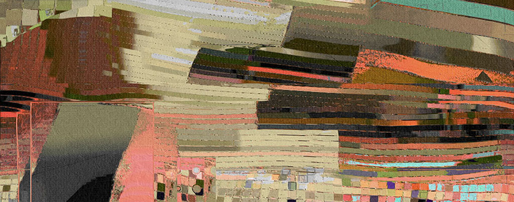
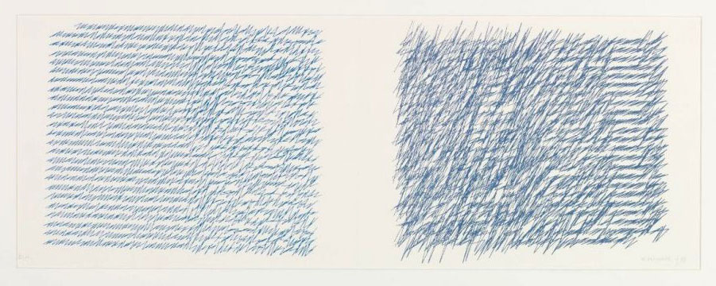
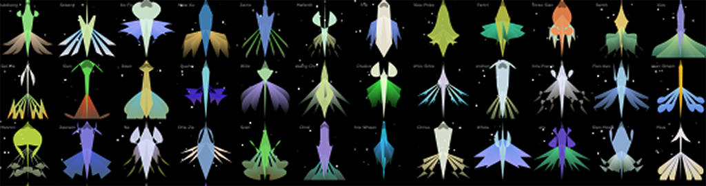
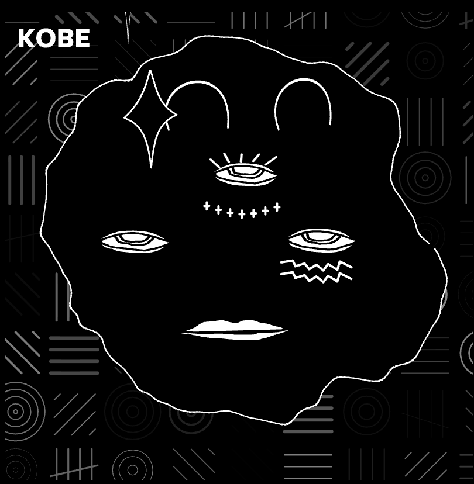

# Unit 2: Creative Coding

Foundations of Electronic Media • 60-120 • Spring 2026

*Creative coding treats programming as a material rather than a utility: a way to think, sketch, and compose through rules, parameters, and systems. In this unit, we will use code to generate form, variation, and time-based behavior, working incrementally from simple visual constraints to systems that produce many outcomes. Our emphasis is not technical mastery, but learning how structured processes, repetition, and controlled variation can become expressive artistic strategies.*


---

## Schedule of Deliverables

Due Monday **2/9** (for Section A) or Tuesday **2/10** (for Section B): 

* [2.1. Orientation](#21-orientation) *(15m)*
* [2.2. Looking Outwards: Generative Art](#22-looking-outwards-generative-art) *(30m)*
* [2.3. Reading-Response: Artist Narratives](#23-reading-response-artist-narratives) *(30m)*
* [2.4. Reading-Response: Effective Complexity and The Oatmeal Problem](#24-reading-response-effective-complexity-and-the-oatmeal-problem) *(45m)*
* [2.5. Warmup Exercise: Ten Shapes, One Rule](#25-warmup-exercise-ten-shapes-one-rule) *(45m)*

Due Wednesday **2/11** (for Section A) or Thursday **2/12** (for Section B): 

* [2.6. Face Generator](#26-face-generator) *(2.5h)*

Due Monday **2/16** (for Section A) or Tuesday **2/17** (for Section B): 

* [2.7. Pattern Generator](#27-pattern-generator) *(4h)*

Due Monday **2/23** (for Section A) or Tuesday **2/24** (for Section B): 

* [2.8. Computational Clocks](#28-computational-clocks) *(5h)*


---

## 2.1. Orientation

Before the end of class on February 4th/5th, please make sure to have done the following:

* If you don't already have one, **create** an account at OpenProcessing.org.
* In your laptop’s web browser, **bookmark** [our OpenProcessing classroom](https://openprocessing.org/class/104705#/), whose URL is [https://openprocessing.org/class/104705#/](https://openprocessing.org/class/104705#/).
* **Join** our OpenProcessing classroom. To do this, **login** to your OpenProcessing account. Then **locate** and **use** the provided private “**OpenProcessing Invite Link**” to join our OpenProcessing classroom, which you can find [here](https://discord.com/channels/1459919117493473312/1459919118860943524/1459952218739314688) in the `#key-information` channel in our Discord.

*Now: (15 minutes; Due Monday 2/9 or Tuesday 2/10)*

**Spend 15 minutes familiarizing yourself** with the following online resources. The goal here is simply to make sure you are *aware* of these media, that you have seen them with your *eyes*, that you know *where* to find them, and that you know *how* they can help you. *There is no deliverable for this exercise.*

* Here's a [p5.js **Cheat Sheet**](https://bmoren.github.io/p5js-cheat-sheet/)
* This is the official [p5.js **Reference**](https://p5js.org/reference/)) and the [older version](https://archive.p5js.org/reference/) that you might like better.
* Here are the [p5.js **Examples**](https://archive.p5js.org/examples/). I recommend you browse at least five of them.
* Here are some extremely helpful and important **YouTube tutorial channels**: 
  * The legendary [**Coding Train**](https://www.youtube.com/@TheCodingTrain/videos) by Dan Shiffman — featuring 1200+ videos, ranging from [this great p5.js introduction](https://www.youtube.com/watch?v=HerCR8bw_GE&list=PLRqwX-V7Uu6Zy51Q-x9tMWIv9cueOFTFA) to very advanced tutorials
  * [PattVira](https://www.youtube.com/@pattvira) – excellent tutorials (by a CMU alum!), including this great [introductory playlist](https://www.youtube.com/playlist?list=PL0beHPVMklwgMz4Z-mNp4_udo9mjBk7pn)
  * [Xin Xin](https://www.youtube.com/@xinxin1011) — some more excellent introductory videos
* Of possible interest:
  * [p5.j​​s 中文教程](https://www.youtube.com/watch?v=uEffNzLcn60&list=PLznBLb1-pQM_piONXfwND-0h3h493vO1k) by [QianQian Ye](https://qianqian-ye.com/)
  * [한국어로 된 p5.js 튜토리얼](https://www.youtube.com/watch?v=j2fbcQqzJzE&list=PLgAffhOqz2QE0o6TeDW345rcA_YBCDqnt)

<!-- * ["Getting Started with p5.js"](https://openlab.citytech.cuny.edu/mtec1101-hd88-sp2022/files/2019/03/Make_Getting-Started-with-p5dotjs.pdf) **book** by Lauren Lee McCarthy: [PDF](https://openlab.citytech.cuny.edu/mtec1101-hd88-sp2022/files/2019/03/Make_Getting-Started-with-p5dotjs.pdf), [PDF](https://intronewmedia150.wordpress.com/wp-content/uploads/2019/08/gettingstartedp5.pdf). -->

---

## 2.2. Looking Outwards: Generative Art



*(30 minutes; Due Monday 2/9 or Tuesday 2/10)*

> *“Generative art refers to any art practice where the artist uses a system, such as a set of natural language rules, a computer program, a machine, or other procedural invention, which is set into motion with some degree of autonomy contributing to or resulting in a completed work of art.”* — Philip Galanter

In this exercise, you'll look at some artworks, and make a brief post about one that caught your eye. *So:* 

* [**Here is a list**](some_generative_artworks.md) of about 50 generative artworks. **Browse** these pages, and **select** a project you like (or which appeals to you more than the others). 
* **Create** a post in the Discord channel `#2-2-looking-outwards`. In your post,
* **state** the project's title and artist;
* **provide** a link to the project's URL;
* **write** a sentence or two about what you found interesting about it; and
* **include** an image or screenshot of the artwork.

---

## 2.3. Reading-Response: Artist Narratives



*(30 minutes; Due Monday 2/9 or Tuesday 2/10)*

* Briefly **skim** the five short artist narratives below, and **choose** *one* artist's article to focus on. (Each is approximately a 10-15 minute read. You only have to read one article.)
* **Create** a post in the Discord channel `#2-3-narratives`. 
* In your post, **write** 100–150 words responding to the questions below. **Answer** all parts concisely and concretely, please.
	1. *(Process insight)* **Describe** one specific aspect of the artist’s process that stood out to you. For example, this might include how they: begin a project, iterate over time, use constraints, decide when something is “working”, or balance control and surprise.
	2. *(Decision-making)* **Identify** one decision the artist made (conceptual, aesthetic, or technical) that seems especially important to the final work. Why did this decision matter?
	3. *(Personal connection)* Briefly **describe** one way this artist’s process either: *resonates* with how you like to work, or *conflicts* with how you usually approach making things.

**Artist narratives:**

* Robert Hodgin, *Meander* (2020): [**Web**](https://roberthodgin.com/project/meander) / [PDF](pdf/hodgin_meander.pdf)
* Casey Reas, *Phototaxis* (2001-2021): [**Web**](https://medium.com/@REAS/notes-on-phototaxis-db7aa7641ad8) / [PDF](pdf/reas_phototaxis.pdf)
* Vera Molnár, *My Mother’s Letters* (1988-1995): [**PDF**](pdf/molnar-mothers-letters.pdf)
* Zach Lieberman, *Daily Sketches in 2025* (2025) [**Web**](https://zachlieberman.medium.com/daily-sketching-in-2025-60189ffd6b60) / [PDF](pdf/lieberman_2025.pdf)
* Aleksandra Jovanic, *Chromatlas* (2022): [**Web**](http://aleksandrajovanic.com/chromatlas/) / [PDF](pdf/jovanic_chromatlas.pdf)

<!-- * Tyler Hobbs, *Fidenza* (2021): [**Web**](https://www.tylerxhobbs.com/words/fidenza) / [PDF](pdf/hobbs_fidenza.pdf) -->

---


## 2.4. Reading-Response: Effective Complexity and The Oatmeal Problem



*(45 minutes; Due Monday 2/9 or Tuesday 2/10)*

* **Read** [this one-page excerpt from an article](pdf/kate-compton-oatmeal.pdf) from an article by Kate Compton, “So you want to build a generator...” (2016), in which she discusses the challenge of aesthetics in generative art, and introduces what she calls the "10,000 bowls of oatmeal problem". 
* **Read** [this one-page excerpt from an article](pdf/galanter_effective_complexity.pdf) by Philip Galanter, "Generative Art Theory" (2003), in which he discusses the concept of "effective complexity".
* **Create** a post in the Discord channel `#2-4-oatmeal`, and **respond** to both questions below (in about 150 words total): 
  1. *(Critical synthesis)* In your own words, **explain** why a generator that produces endless novelty can still feel boring. Use Compton’s "10,000 Bowls of Oatmeal" problem and/or Galanter’s concept of effective complexity to support your explanation.
  2. *(Constructive reflection)* **Describe** something you personally find endlessly fascinating despite (or because of) small variations. This could be a natural phenomenon, a specific cultural expression, something visual, sonic, etc. Explain what kinds of variation matter and why they remain perceptually meaningful rather than collapsing into "oatmeal."

---

## 2.5. Warmup Exercise: Ten Shapes, One Rule

*Due: Monday 2/9 (for Section A) or Tuesday 2/10 (for Section B). ~45 minutes.*

* **Create** a new sketch at OpenProcessing, with a canvas no larger than 600×600px. 
* **Write** p5.js code to create a single static composition using only the 2D primitive shapes (`ellipse`, `rect`, `line`, `triangle`, `quad`, etc) described [here](https://p5js.org/reference/#Shape). You may use any of these shapes you wish. 
* **Use** exactly 10 shapes total.
* **Choose** one self-imposed rule and follow it strictly. **Select** *one* of the following rules (or devise your own, if you wish):
	* All shapes must share one edge or touch at one point.
	* All shapes are variations of a single proportion.
	* All shapes align to an invisible grid.
	* Only three colors total.
	* Every shape must overlap at least one other.
	* Shapes get progressively larger or smaller.
	* Horizontal symmetry only, no vertical symmetry.
* **Heed** these additional constraints: 
	* Static results *only*. All your code should be in `setup()`, not `draw()`.
	* No image files, no text, no interaction, no randomness.
* In OpenProcessing, **edit** the information about your project (click ⓘ and EDIT). **Add** a title, **capture** a thumbnail screenshot, and **describe** your rule in the description field. 
* Add your project to the [correct OpenProcessing collection](https://openprocessing.org/class/104705/#/c/105114).
* **Create** a post in the Discord channel, `#2-5-ten-shapes`, to document your work,
* In your Discord post, **upload** a screenshot of your exercise. 
* In your Discord post, **Write** 2–3 sentences describing the rule you chose, and something that surprised you about the process of developing your project.

---

## 2.6. Face Generator

*Due: Wednesday 2/11 (for Section A) or Thursday 2/12 (for Section B). ~2.5 hours.*

**Study** these whimsical hand-drawn faces by Bruno Munari (from *Design as Art,* 1969). His drawings are highly economical constructions: a few specific marks stand in for eyes, nose, and mouth, yet they cohere immediately as faces through [gestalt perception](https://en.wikipedia.org/wiki/Gestalt_psychology) rather than realistic rendering. Their humor comes from a tension between abstraction and specificity: each face is unmistakably "someone", even though almost nothing conventionally descriptive is actually drawn.


We now begin an exercise in *procedural character design*. Consider the following examples of *computationally generated faces:* 

<br />Matthias Dörfelt’s [*Weird Faces*](https://www.mokafolio.de/works/Weird-Faces) (2012) — The artist’s attempt to recreate his doodling drawing style in code.

<br />Herman Chernoff’s [multivariate face visualizations](https://en.wikipedia.org/wiki/Chernoff_face) (1973) — displays of multivariate data in the shape of a human face, whose individual parts represent values of the variables by their shape, size, placement and orientation. *(Another example [from Tufte](img/chernoff_tufte.png))*

<br/>[Hyphen Labs](https://hyphen-labs.com/who-is-hyphen-labs) (Ece Tankal and Carmen Aguilar y Wedge), [*Everyday Painkillers*](https://hyphen-labs.com/Everyday-Painkillers) (2016): An installation in which, every 24 minutes (the frequency of U.S. opioid deaths), a script directs an onsite CNC machine to carve a novel face into an additional pill. *([Video from Eyeo 2018](https://vimeo.com/287093806#t=24m40s), jump to 24:40)*

<br />Larva Labs, *Cryptopunks* (2018): 10,000 unique, computationally generated faces; some of the first and most successful NFTs.

*And,*

* Mark Wilson, [Meta-Face](http://mgwilson.com/Drawing%20with%20Computers.pdf) (1985): One of the earliest face generators I could find, pictured below.
* Jean-Paul Delahaye, [face generator from *Nouveaux dessins géométriques et artistiques*](img/delahaye_faces_1985.jpg) (1985).
* Shunsuke Takawo, [Face Generator](https://openprocessing.org/sketch/1207768), 2021 (p5.js), and [another](https://openprocessing.org/sketch/2333020)
* Aditya Jain, [Face Generator](img/aditya_jain_face_generator.gif), 2023 *([original](https://x.com/adityajainart/status/1675563610490413056))*
* Kate Compton, [Face Generator](img/compton_kate_onethird.png)
* And [this nice project](https://openprocessing.org/sketch/1361275) (2025)


[](https://openprocessing.org/sketch/1361275)

#### Requirements

* In [OpenProcessing](https://openprocessing.org/class/104705/#/c/105113), **create** a p5.js sketch whose canvas is no larger than 600x600 pixels.
* **Write** code to generate an image of a face or character. Using the recommended code structure below, your sketch should generate a new character whenever the user clicks the mouse button.
  * Your project should be parameterized by **at least three variables**, but preferably more (aim for 5–10). Include at least one *discrete* parameter (such as a variable that controls the number of eyeballs, or the presence or absence of a hat), and one *continuous* parameter (such as a variable that controls the size, position, and/or color of features).
  * Your project should include at least one **grounding cue**, such as a background shape or color, neck/shoulders, or a simple prop. Keep it minimal.
* **Upload** your project to the correct [OpenProcessing collection](https://openprocessing.org/class/104705/#/c/105113).
* **Create** a post in the Discord channel, `#2-6-face-generator`.
* In your post, **upload** a couple of screenshots, showing your generator's variety.
* **Write** a sentence to direct our attention. What are you proudest of? 
* **Write** a sentence listing a few of your face's most important variables (e.g. "nose size; number of pimples", etc.)

<details><summary><strong>Helpful Tutorials</strong></summary>
Feeling uncertain? These tutorials may be helpful. 

**Golan's Tutorials at OpenProcessing**

* [**Tutorial on variables**](https://openprocessing.org/sketch/2531328#page-1) (variables, for-loop, if-statement, scoping)
* [**Tutorial on random compositions**](https://openprocessing.org/sketch/2540323)

**Variables**

* [Variable - Creative Coding with p5.js](https://www.youtube.com/watch?v=xhdIJo8lxWA&list=PL0beHPVMklwgMz4Z-mNp4_udo9mjBk7pn&index=5) (Patt Vira)
* [2.1: Variables in p5.js (mouseX, mouseY)](https://www.youtube.com/watch?v=RnS0YNuLfQQ&list=PLglp04UYZK_PrN6xWo_nJ-8kzyXDyFUwi) (Coding Train)
* [2.2: Variables in p5.js (Make your own)](https://www.youtube.com/watch?v=Bn_B3T_Vbxs&list=PLglp04UYZK_PrN6xWo_nJ-8kzyXDyFUwi) (Coding Train)

**Conditional Testing**

* [Conditionals (Boolean Expression)](https://www.youtube.com/watch?v=V8aJnrXlGhY&list=PL0beHPVMklwgMz4Z-mNp4_udo9mjBk7pn&index=6) (Patt Vira)
* [Conditionals (If, Else If, Else)](https://www.youtube.com/watch?v=btVdEgjooGE&list=PL0beHPVMklwgMz4Z-mNp4_udo9mjBk7pn&index=7) (Patt Vira)

**Iteration**

* [For and While Loops](https://www.youtube.com/watch?v=cnRD9o6odjk&t=1s) (Coding Train)
* [For Loop - Creative Coding with p5.js](https://www.youtube.com/watch?v=SFAQ9cn5ImE&list=PL0beHPVMklwgMz4Z-mNp4_udo9mjBk7pn&index=9) (Patt Vira)
* [For Loop - p5.js Tutorial](https://www.youtube.com/watch?v=QdGeb0H5idM&list=PLT233rQkMw761t_nQ_6GkejNT1g3Ew4PU&index=12) (Xin Xin)
</details>

#### Development Notes

In your project, you might have variables that specify the size, position, color, or other visual characteristics of the eyes, nose, and mouth. By randomizing these values, you could vary properties like: the face’s expression (happy, sad, angry); the face’s identity (Chris, Pat, Alex, Sam); or the face’s species (cat, monkey, zombie, alien). (These are just examples.) Give special consideration to controlling the precise shape of face parts, such as the curves of the nose, chin, ears, and jowls, and/or characteristics such as skin color, stubble, hairstyle, blemishes, inter-pupillary distance, facial asymmetry, cephalic index, and prognathism.

**Place your character.** A face floating in an empty void feels unfinished because it omits context that helps viewers interpret scale, orientation, mood, and identity. Even minimal surroundings provide visual grounding: a neck and shoulders establish anatomy and posture; a background color or simple shape sets contrast and emotional tone; a hint of environment can imply lighting and narrative. A little context can help you make a much more compelling character system, and it does so with very little extra code.

We recommend you **begin** with the code template provided below. The particular structure of this code will allow your sketch to generate a new face whenever the user clicks the mouse button.


```
function setup() {
  createCanvas(600, 600);
}

function draw() {
  background('white'); 
  // generate a face HERE...
  noLoop();
}

function mousePressed(){
  loop();
}
```

If you're curious, [**here are a few face generators**](student_face_generators.md) made by previous students from this course. We will evaluate your generator based on considerations including its:

* *Range*: produces meaningfully different faces across clicks (it's not oatmeal).
* *Authorship*: style choices are intentional and specific (only *you* could have made this).

*Please do not use an LLM to write this code for you. LLMs will make generic faces; we are interested in eliciting your own creative work, no matter how basic your skills are. If you do use an LLM for code, you must disclose it in your post.*

---

## 2.7. Pattern Generator


*Due Monday 2/16 (for Section A) or Tuesday 2/17 (for Section B). ~4 hours.*

### This Assignment has 5 Parts!

The first four parts ([2.7.A](https://openprocessing.org/class/104705/#/c/105301), [2.7.B](https://openprocessing.org/class/104705/#/c/105299), [2.7.C](https://openprocessing.org/class/104705/#/c/105302), and [2.7.D](https://openprocessing.org/class/104705/#/c/105300)) are brief technical exercises. These will help you develop the skills you'll need to execute the main creative project, **2.7.E Pattern Generator.**

1. [2.7.A. Exercise: Lines to the Cursor](https://openprocessing.org/class/104705/#/c/105301) (10 minutes)
2. [2.7.B. Exercise: Transitioning Rectangles](https://openprocessing.org/class/104705/#/c/105299) (20 minutes)
3. [2.7.C. Exercise: Iteration & Positioning](https://openprocessing.org/class/104705/#/c/105302) (15 minutes)
4. [2.7.D. Exercise: Nested Iteration & Randomness](https://openprocessing.org/class/104705/#/c/105300) (20 minutes)
5. [**2.7.E. Pattern Generator**](https://openprocessing.org/class/104705/#/c/105115) (3 hours)


> *Pattern is the starting point from which we perceive and impose order in the world. Examples of functional, decorative, and expressive pattern-making date from ancient times and take the form of mosaics, calendars, tapestry, quilting, jewelry, calligraphy, furniture, and architecture. There is an intimate connection between pattern design, visual rhythm, geometry, mathematics, and iterative algorithms. This assignment invites you to hone your understanding of these relationships in formal terms.*

In this project, you are asked to write code to generate “infinite” variations of a tiling pattern or repetitive textural composition, as for wallpaper or fabric. Your pattern should be designed so that it could be infinitely tiled or extended. Design something you would like to put on the walls or floor of your home, or that you might imagine yourself wearing. (Images by [Saskia Freeke](https://sasj.nl/portfolio/).)

* **Warm up** by completing the four brief technical exercises, [2.7.A](https://openprocessing.org/class/104705/#/c/105301), [2.7.B](https://openprocessing.org/class/104705/#/c/105299), [2.7.C](https://openprocessing.org/class/104705/#/c/105302), and [2.7.D](https://openprocessing.org/class/104705/#/c/105300). These should hopefully take you less than an hour. 
* In OpenProcessing, **create** a new sketch which fills the full screen, using `createCanvas(windowWidth, windowHeight)`. 
* **Write** code that renders one or more simple, small visual motif(s). You may use any colors and shapes you please. You may work abstractly, or you can design a motif such as a leaf, flower, etc.
Using “nested iteration”, write additional code that renders your motif(s) numerous times, as in a patterned grid.
* **Add** some randomness so that each repeat of the motif is slightly different from the others.
* **Upload** your project to the correct [OpenProcessing collection](https://openprocessing.org/class/104705/#/c/105115). 
* **Post** a screenshot to the Discord channel, `#2-7-pattern`. 
* **Write** a sentence to describe your goals, approach, challenges, and/or experience.

**Give consideration to:**

* *Symmetry*, whether achieved through reflection or rotation. Experiment with 2D graphics transformations, such as rotation, scaling, and mirror reflections
* *Rhythm*. Try using nested iteration to develop 2D patterns or other gridlike structures
* *Positive vs. negative space*
* *Foreground*, middle-ground, and background “layers”
* *Detail at multiple scales*, i.e., variation at the macro-scale, meso-scale, and micro-scale.
* The *potential for surprise* through the placement of infrequent features
* Give attention to *color*. Feel free to use a palette creator, a palette extraction tool, etc.
* *Randomness*. Give consideration to the depth of variation in your pattern, and how randomness shapes the design. After how many viewings does your pattern become predictable? How might you forestall this as long as possible? At least 3 different parameters must be subject to variation.


---

## 2.8. Computational Clock(s)

*Due Monday 2/23 (for Section A) or Tuesday 2/24 (for Section B). ~5 hours.*

*Details TBA.*