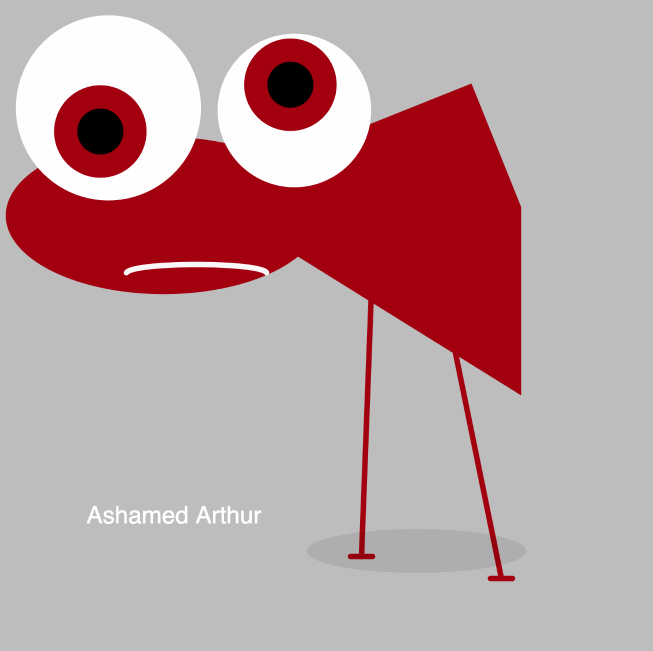
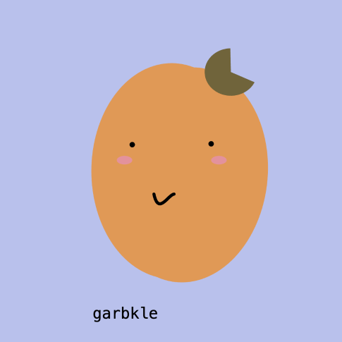
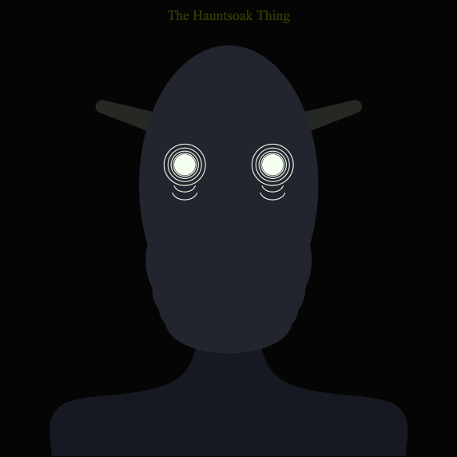
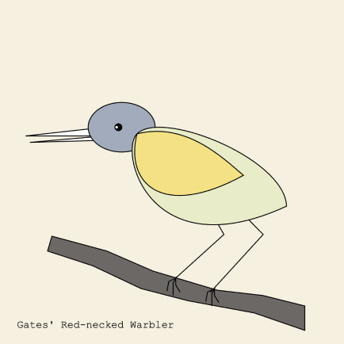
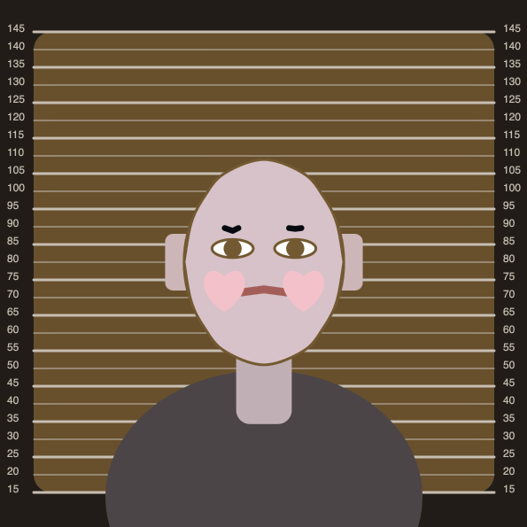
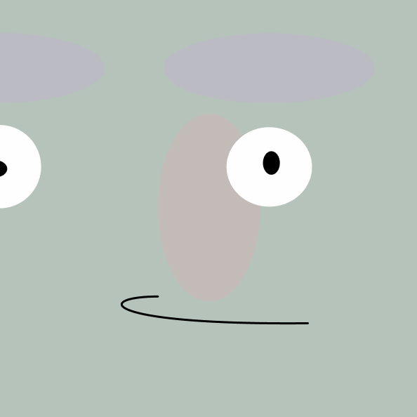

# Some Previous Student Face Generators

Here are some screen recordings of face generators created by previous CMU School of Art students from this course (60-120), 2023-2025. 

---

[Munin Jitsajjapong](https://openprocessing.org/sketch/2546600), *Passive Agressive Critters* 

[Amanda Barajas](https://openprocessing.org/sketch/2544497), *Ambiguous Fruit Face Generator* 

[Annie Yang](https://openprocessing.org/sketch/1844871), *OMG* 

[Tippi Li](https://openprocessing.org/sketch/2186269), *Sushi Generator* 

[Owen Noble](https://openprocessing.org/sketch/2540779), *Cryptid Generator* 

[Emma Deng](https://openprocessing.org/sketch/1837268), *Face Gen* 

[Zahra El Ansary](https://openprocessing.org/sketch/2544127), *Fake Bird Generator* 


[Lorie Chen](https://openprocessing.org/sketch/1838805), *Mugshots* 

[Aidan Hong](https://openprocessing.org/sketch/1840884), *Virus Generator* 

[Annie Marcelino](https://openprocessing.org/sketch/2543621), *Face Generator* 

[Erin Hsu](https://openprocessing.org/sketch/2186255), *Text Faces* 

---

* [Xiao Yuan](https://openprocessing.org/sketch/2182980), *Lyin*
* [Bee Jackson](https://openprocessing.org/sketch/2180763), *Tangled Birdz*

