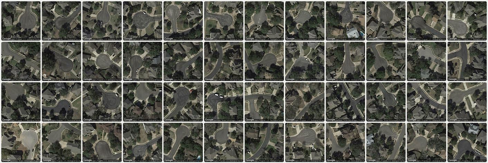

# Unit 3: Digital Curation / Internet Readymade

Foundations of Electronic Media • 60-120 • Spring 2026

*Speed project. Due Wednesday March 11 or Thursday, March 12. Estimated time: 6 hours.*

---

This assignment focuses on **discovery, selection, framing, and publication**, rather than invention or fabrication. You are not being asked to make new media objects. Instead, you will work as an **artist–curator**, using careful collection and presentation to reveal something that is already present but largely unnoticed.

Your task is to identify a narrow slice of internet culture and treat it as material for inquiry. Through accumulation and presentation, your collection should make a pattern, question, bias, or system visible. A single example may feel like an accident; a *collection* becomes evidence.

You will publish your work as a “single-serving” web page. This is not a portfolio site and not a personal brand statement. It is a focused, self-contained exhibition.

#### Learning Objectives

* **Conduct research** to critically examine the internet by **curating** a focused collection of found digital material — leveraging selection, repetition, and comparison to transform isolated examples into meaningful evidence.
* **Publish** a self-contained, public-facing web page that communicates your curatorial idea clearly through layout, structure, and basic web-based presentation tools.

---

# What to Do

This project is due:

* **Wednesday March 11** (Section A) or
* **Thursday, March 12** (Section B).

## 1. Collect

**Collect** a coherent set of digital “media-objects” that you believe are interesting but under-appreciated, overlooked, or largely undocumented.

* Your collection may consist of images, screenshots, videos, text fragments, metadata, interface states, search results, defaults, or other digital traces.  
* The collection may originate online or in real life, but it must be *documented digitally*.  
* Aim for *typological clarity*: the items should clearly belong together, and their meaning should emerge through repetition and comparison. 
* You may work from any standpoint you prefer: aesthetic, political, historical, anthropological, etc.

## 2. Curate and Publish 

**Organize** and **publish** your collection as a public-facing webpage using **either** [Hotglue.me](https://hotglue.me/) or [mmm.page](https://mmm.page/). (Free account required.) *Note: Using WordPress.com is discouraged because its complex structure tends to distract from focused, single-page curatorial work.*

By **organizing** your collection, we mean that you should:

* **select** what to include and exclude,
* **arrange** items intentionally,
* **allow** relationships, contrasts, or patterns to become legible,
* **guide** your viewer to understand what they are seeing. A sentence or two of explanation should be enough; avoid paragraph-length text, and let the structure of your collection do most of the work.

## 3. Document

* **Create** a post in the `#3-1-digital-curation` channel.
* **Include** the URL link to your Hotglue or mmm page.
* **Write** a short description (3–6 sentences) explaining what your collection *is*; *why* it interests you; and *how* you gathered, filtered, or constrained the material.
* **Embed** a screenshot of your published page, and several small example images from your collection.

---

## Guidance and Constraints

* **Specificity is a strength.** The more *arcane and oddly specific* your collection is, the better. We challenge you to identify and collect a category of something that feels newly identified through your research.
* **This is not a mood board.** Your goal is not aesthetic coherence alone, but conceptual clarity.
* **This is not authorship-through-fabrication.** You should not be generating new images, drawings, or designs.
* You are encouraged to review:
  - [Lecture notes on digital curation](../../../lectures/digital_curation/readme.md)
  - [Lecture notes on typologies](https://github.com/golanlevin/ExperimentalCapture/blob/master/docs/typologies.md#collections-presented-in-time)

---

## How This Will Be Evaluated

Successful projects will demonstrate:

* **Clear curatorial intent**: it is obvious why these items belong together.
* **Typological thinking**: the collection reveals something that no single item could.
* **Careful selection and framing**: inclusion, exclusion, and arrangement matter.
* **Research rigor**: the collection reflects sustained inquiry rather than casual browsing.
* **Legibility**: a viewer should be able to grasp what the collection is *about*, even without explanation.
* **Scale and commitment**: the collection is large enough to support its claim (typically more than a mere handful of items).

---

<!-- - **Previously made collection projects are allowed**, including projects from “Risk, Agency, Failure,” *except*: you may **not** document food trash or food packaging. This category is no longer available. -->