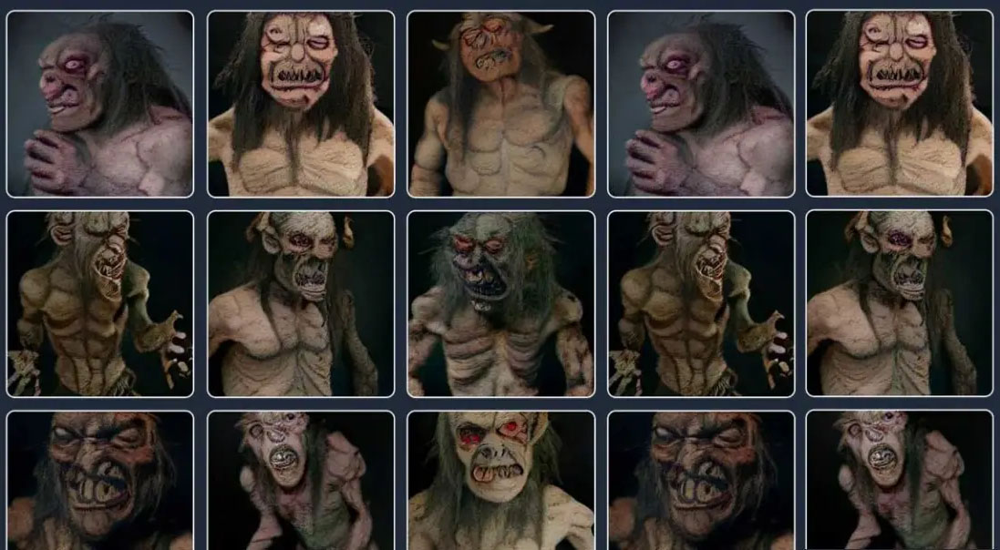
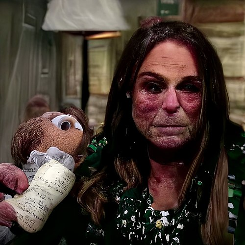

# AI: The Bad

---

AI systems are trained on the work of artists. The models can then superficially create 'new' works in that artists' style.

---

[Generative AI systems infringe by default](https://x.com/Rahll/status/1835752715537826134), a thread by Reid Southen.

> I'm tired of having to prove to people that generative AI systems infringe by default, so here's a megathread of images I've prompted you can use in your discussions. We've shown that very simple descriptions can result in images that are strikingly similar to the training data.

---

[Generative AI is being used for misinformation](https://x.com/reshetz/status/1815648517081190457) ("ignore all prevous instructions"), a new Turing test.

---

[Meta's RayBans train AI on anything you look at](https://www.instagram.com/ainterestingaf/p/CrtBRWSowIJ/?img_index=1)

---

Digital cryptids: like [Crungus](https://futurism.com/ai-nightmare-crungus) and [Loab](https://en.wikipedia.org/wiki/Loab), as [discussed by James Bridle](https://x.com/jamesbridle/status/1567794871716532225), embed frightening biases.

  
<strong>Click here</strong> to see Crungus.

  
<strong>Click here</strong> to see Loab.

---

Even seemingly innocuous operations like outpainting can have unintended consequences ([profile pic story](https://www.linkedin.com/posts/elizabethlaraki_im-talking-at-a-conference-next-month-on-activity-7252374626972938240-KVQr/))

> I'm talking at a conference next month (on UX+AI). Yesterday, I saw an ad for it with my photo and something didn’t look right. Was my bra always showing on my profile pic and I'd never noticed? Weird... So I opened my original photo. Nope. No bra showing. I put the two photos side by side and I was like WTF. Someone edited my photo to unbutton my blouse and reveal a made-up hint of a bra or something else underneath. Immediately, I emailed the conference hosts and called this out. They were super apologetic, took the image down immediately, looked into the issue, and quickly reported back. I had originally sent them a vertical profile photo. They had cropped all speaker photos to be square for their website. The person running their social media didn't have my original image and she grabbed the square, cropped image from their website. She wanted it to be more vertical for the ad, so she used an AI expand image tool to make the photo taller. AI invented the bottom part of the image...in which it believed that women's shirts should be unbuttoned further, with some tension around the buttons, revealing a little hint of something underneath.

---

[OpenAI Used Kenyan Workers on Less Than $2 Per Hour to Make ChatGPT Less Toxic](https://web.archive.org/web/20230307080302/https://time.com/6247678/openai-chatgpt-kenya-workers/)

> [**Content Warning**] In its quest to make its models less toxic, OpenAI used outsourced Kenyan laborers earning less than $2 per hour. OpenAI sent tens of thousands of snippets of text to an outsourcing firm in Kenya. Much of that text appeared to have been pulled from the darkest recesses of the internet. Some of it described situations in graphic detail like child sexual abuse, bestiality, murder, suicide, torture, self harm, and incest. One worker tasked with labeling text for OpenAI told TIME he suffered from recurring visions after reading a graphic description. “You will read a number of statements like that all through the week. By the time it gets to Friday, you are disturbed from thinking through that picture.”

For more information on this kind of harm to information workers, see the Verge article, [The Trauma Floor: The secret lives of Facebook moderators in America](https://www.theverge.com/2019/2/25/18229714/cognizant-facebook-content-moderator-interviews-trauma-working-conditions-arizona) (2019), which discusses the lives of content moderators who are paid to filter violence, pornography, and worse from social media sites.

---

Also, FYI: [Works created entirely with AI can't be copyrighted in the USA](https://www.cooley.com/news/insight/2024/2024-01-29-copyright-ownership-of-generative-ai-outputs-varies-around-the-world#:~:text=copyright%20will%20only%20protect%20the%20human%2Dauthored%20aspects%20of%20the%20work)
