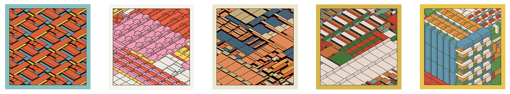

# Wednesday, February 11, 2026

---

1. [Xylz](https://www.youtube.com/watch?v=f4GfEcTMADc) & Attendance
2. Brief viewings of [Face Generators](https://openprocessing.org/class/104705/#/c/105114)
  * Some [face generators by previous students](../assignments/unit_2/student_face_generators.md)
  * Google [form for evaluating face generators](https://forms.gle/1VD8rqPLLUURjRAW9)
3. [Technical Presentations in Class](#technical-presentations-in-class)
4. [Lecture on Pattern](https://github.com/golanlevin/lectures/tree/master/lecture_pattern)
4. Introduction to the [**Pattern Generator**](../assignments/unit_2/readme.md#27-pattern-generator) assignment
5. In-class Work Session

---

### Technical Presentations in Class

* [**Tutorial on Nested Iteration**](https://openprocessing.org/sketch/2542778#page-1) (double-for-loop)
* [**Tutorial on Transforms**](https://openprocessing.org/sketch/2869389#page-1)
* [Tutorial on Functional Abstraction](https://openprocessing.org/sketch/2542795#page-1) *(time permitting)*
* [Tutorial on Truchet Tiles](https://openprocessing.org/sketch/2731464#page-1) *(time permitting)*
* [push/rotate/pop within a for loop: rotated hearts](https://openprocessing.org/sketch/1835700)

---

### Some Helpful Videos

These YouTube tutorials may be helpful in understanding today's material. 

#### For Loop

* [For and While Loops](https://www.youtube.com/watch?v=cnRD9o6odjk&t=1s) (Coding Train)
* [For Loop - Creative Coding with p5.js](https://www.youtube.com/watch?v=SFAQ9cn5ImE&list=PL0beHPVMklwgMz4Z-mNp4_udo9mjBk7pn&index=9) (Patt Vira)
* [For Loop - p5.js Tutorial](https://www.youtube.com/watch?v=QdGeb0H5idM&list=PLT233rQkMw761t_nQ_6GkejNT1g3Ew4PU&index=12) (Xin Xin)

#### Nested For-Loops

* [Nested Loops - p5.js Tutorial](https://www.youtube.com/watch?v=1c1_TMdf8b8) (Coding Train)
* [Nested Loop - Creative Coding with p5.js](https://www.youtube.com/watch?v=A-ebumU7e7s) (Patt Vira)
* [p5.js Coding Tutorial | 2D Grid w Nested Loop](https://www.youtube.com/watch?v=UKxB2j4h7Ag) (Patt Vira)
* [Nested for Loop - Draw a Grid! - p5.js Tutorial](https://www.youtube.com/watch?v=FAVvj1M6klc) (Xin Xin)

#### Transforms (Translate, Rotate, Scale)

* [2D Transformations in p5js with translate(), scale(), and rotate()](https://www.youtube.com/watch?v=ZgkveKnc7E8) (Prof. Chris)
* [Translate, rotate, push, pop)](https://www.youtube.com/watch?v=o9sgjuh-CBM&list=PLqbYLl2ZsH6hdnZrpNqF5a6DrGdljLpWC) (Coding Train)
* [translate(), rotate(), push(), pop() - p5.js Tutorial](https://www.youtube.com/watch?v=maTfm84mLbo) (Xin Xin)
* [rotate() + for Loop - Pattern Making Tip - p5.js Tutorial](https://www.youtube.com/watch?v=kP-RkS70Lm8) (Xin Xin)

---

