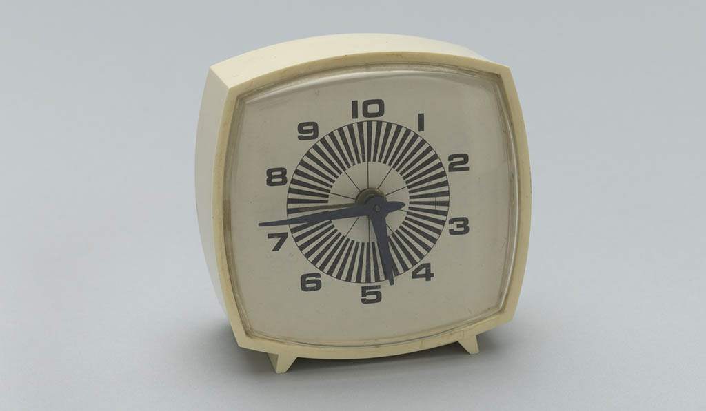

# Monday, February 16, 2026

1. [Coldplay Clocks](https://www.youtube.com/watch?v=xjRQvbPh9tQ) & Attendance
2. Review of [Pattern Generators](https://openprocessing.org/class/104705/#/c/105114)
  * Some [pattern generators by previous students]()
  * [Form for evaluating pattern generators]()
4. [Representing Time; Clocks, Reimagined](https://github.com/golanlevin/lectures/tree/master/lecture_clock)
5. Introduction to the [Clock](../assignments/unit_2/readme.md#27-pattern-generator) assignment
6. [Technical Presentations in Class](#technical-presentations-in-class)

---

### Technical Presentations in Class

* String concatenation, `print()`, `text()`, `nf()`
* `hour()`, `minute()`, `second()`, `millis()`
* `day()`, `month()`, `year()`
* [map()](https://archive.p5js.org/reference/#/p5/map), [lerp()](https://archive.p5js.org/reference/#/p5/lerp)

---

### Some Helpful Videos

These YouTube tutorials may be helpful in understanding today's material. 

#### Clocks 

* Coding Train's [clock tutorial](https://www.youtube.com/watch?v=E4RyStef-gY)
* Patt Vira's [clock tutorial](https://www.youtube.com/watch?v=3Aa8CzklS6c)
* Xin Xin's [clock tutorial](https://www.youtube.com/watch?v=JgLlQPF22Gw)

---

