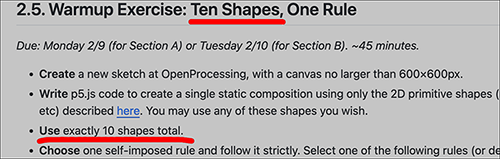

# Tuesday, February 10, 2026

---

### Agenda

1. Brief viewings of your [10-Shapes-1-Rule](https://openprocessing.org/class/104705/#/c/105114) projects 
2. [Technical Presentations in Class](#technical-presentations-in-class)
3. Introduction to the [**Face Generator**](../assignments/unit_2/readme.md#26-face-generator) assignment (due this Thursday 2/12).  *Additional viewings, time permitting:* 
	* Lorenzo Bravi, [*Bla Bla Bla*](https://www.lorenzobravi.com/workshop/bla-bla-bla/) (2010)
	* Matthias Dörfelt, [*Munching*](https://www.mokafolio.de/works/Munching) (2014)
	* Zachary Lieberman, [*Más Que la Cara Overview*](https://zachlieberman.medium.com/m%C3%A1s-que-la-cara-overview-48331a0202c0) (2017)
	* Heather Dewey-Hagborg, [*Stranger Visions*](https://www.youtube.com/watch?v=VCrthd9Fn_c) (2013)
	* Robb Godshaw, [*Strange Lenses*](https://www.youtube.com/watch?v=Bz7wzzccpgE) (2016)
4. In-class Work Session

---

### Technical Presentations in Class

* [**Tutorial on variables**](https://openprocessing.org/sketch/2531328#page-1) (variables, for-loop, if-statement, scoping)
* [**Tutorial on random compositions**](https://openprocessing.org/sketch/2540323)

New p5.js commands introduced today:

* [setup()](https://archive.p5js.org/reference/#/p5/setup), [draw()](https://archive.p5js.org/reference/#/p5/draw), [mousePressed()](https://archive.p5js.org/reference/#/p5/mousePressed)
* [width](https://archive.p5js.org/reference/#/p5/width), [height](https://archive.p5js.org/reference/#/p5/height)
* [random()](https://archive.p5js.org/reference/#/p5/random)
* [print()](https://archive.p5js.org/reference/#/p5/print)
* [beginShape()](https://archive.p5js.org/reference/#/p5/beginShape), [vertex()](https://archive.p5js.org/reference/#/p5/vertex), [curveVertex()](https://archive.p5js.org/reference/#/p5/curveVertex), [endShape()](https://archive.p5js.org/reference/#/p5/endShape)

---

### Some Helpful Videos

Feeling uncertain? These YouTube tutorials may be helpful in understanding today's material. 

#### Variables

* [Variable - Creative Coding with p5.js](https://www.youtube.com/watch?v=xhdIJo8lxWA&list=PL0beHPVMklwgMz4Z-mNp4_udo9mjBk7pn&index=5) (Patt Vira)
* [2.1: Variables in p5.js (mouseX, mouseY)](https://www.youtube.com/watch?v=RnS0YNuLfQQ&list=PLglp04UYZK_PrN6xWo_nJ-8kzyXDyFUwi) (Coding Train)
* [2.2: Variables in p5.js (Make your own)](https://www.youtube.com/watch?v=Bn_B3T_Vbxs&list=PLglp04UYZK_PrN6xWo_nJ-8kzyXDyFUwi) (Coding Train)

#### Conditional Testing (`if`, `else`)

* [3.1 If, Else, Else If - p5.js Tutorial](https://www.youtube.com/watch?v=nFQwVikjee8&list=PLT233rQkMw761t_nQ_6GkejNT1g3Ew4PU&index=5) (Xin Xin)
* [3.1.1 IF / ELSE Example - Make a Drawing Machine](https://www.youtube.com/watch?v=ucrlrVoe9Ns&list=PLT233rQkMw761t_nQ_6GkejNT1g3Ew4PU&index=6) (Xin Xin)
* [Conditionals (Boolean Expression)](https://www.youtube.com/watch?v=V8aJnrXlGhY&list=PL0beHPVMklwgMz4Z-mNp4_udo9mjBk7pn&index=6) (Patt Vira)
* [Conditionals (If, Else If, Else)](https://www.youtube.com/watch?v=btVdEgjooGE&list=PL0beHPVMklwgMz4Z-mNp4_udo9mjBk7pn&index=7) (Patt Vira)

#### Iteration (`for` Loop)

* [For and While Loops](https://www.youtube.com/watch?v=cnRD9o6odjk&t=1s) (Coding Train)
* [For Loop - Creative Coding with p5.js](https://www.youtube.com/watch?v=SFAQ9cn5ImE&list=PL0beHPVMklwgMz4Z-mNp4_udo9mjBk7pn&index=9) (Patt Vira)
* [For Loop - p5.js Tutorial](https://www.youtube.com/watch?v=QdGeb0H5idM&list=PLT233rQkMw761t_nQ_6GkejNT1g3Ew4PU&index=12) (Xin Xin)

