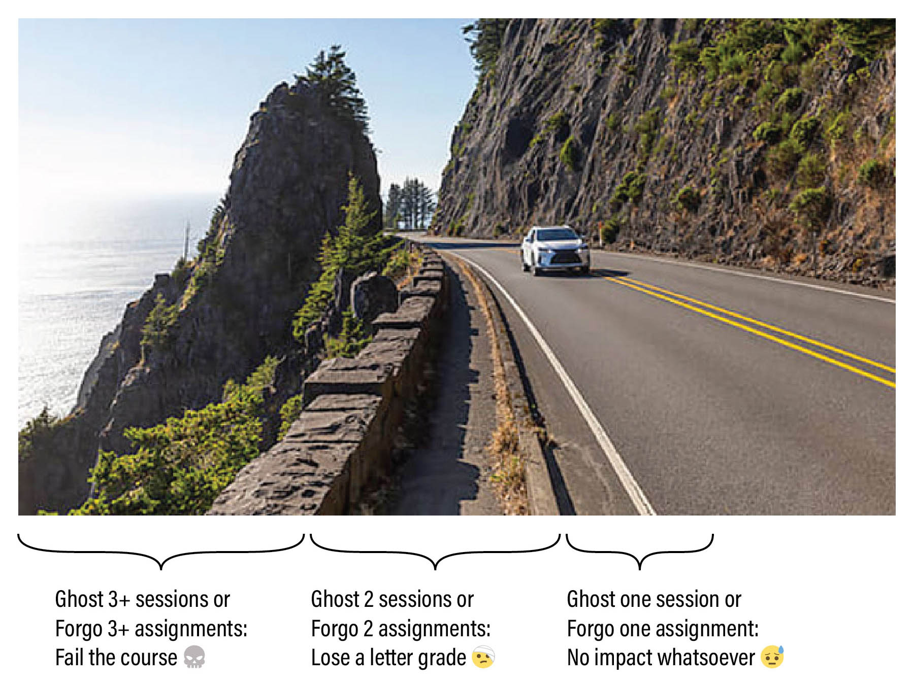

# Syllabus for 60-120 — Spring 2026

*Foundations: Digital Media* (60-120) Professors Golan Levin and Johannes DeYoung, CMU School of Art

### Contents

* [**TLDR**](#tldr)
* [**Overview**](#overview)
* [**Course Profile**](#course-profile)
* [**Administrative Information**](#administrative-information)
* [**Attendance Policies**](#attendance-policies)
* [**Grading and Evaluation Policies**](#grading-and-evaluation-policies)
* [**Academic Integrity**](#academic-integrity)
* [**Accommodations**](#accommodations)
* [**Code of Conduct**](#code-of-conduct)
* [**Take Care of Yourself**](#take-care-of-yourself)
* [**Classroom Hygiene**](#classroom-hygiene)

---

# TL;DR

Your grade in this course will be based on your professionalism in completing work and attending class, subject to the policies summarized below:

**Assignment Policy:**

There will be 5 main assignments (projects) this semester. 

* 😓 Forgo 1 assignment: no impact on your semester grade whatsoever.
* 🤕 Forgo 2 assignments: lose a letter grade for the semester.
* 💀 Forgo 3+ assignments: fail the class altogether.

Each assignment has a clearly defined checklist of subtasks, whose purpose is to help you develop discipline in creating, documenting, and presenting your work. Your grade is straightforwardly calculated from your fulfillment of these checklists; partially completed assignments are graded as such. Generally, one important subtask will be to present the project during a scheduled in-class critique; late work will therefore have points deducted. A set of assignments is considered "forgone" if it is less than 15% completed and/or more than one week late. 

**Attendance Policy:**

* 😓 Ghost 1 session: no impact whatsoever.
* 🤕 Ghost 2 sessions: lose a letter grade.
* 💀 Ghost 3+ sessions: fail the class.

Attendance is important, but if you need to miss class — which can happen, within reason — you are expected to be responsible about *communicating professionally* with the professor about your attendance. Here, "ghosting" refers specifically to "No-call, No-show" attendance events — not excused absences. That said, this flexibility should not be abused; additional policies (see below) may take effect if you incur more than 3 excused absences.

---

# Overview

### Course Description

*Foundations: Digital Media* (60-120) is a practical introduction to expanded modes of creative practice made possible by the computer. In this studio course, you will develop the skills and confidence necessary to produce generative, interactive, and immersive artworks; discuss your work in relation to current and historic praxes of electronic art; and engage new technologies critically. Topics will include no-code and low-code approaches to: generative AI; computational image generation; branching narratives and interactive storytelling; internet art and creative interventions in networked platforms; and camera-based interactivity and immersive audiovisuals.

### Learning Objectives

In this course you will:

* Develop familiarity with a wide range of contemporary artists that use digital media and the Internet as core components of their practice.
* Learn the foundations of coding for visual applications.
* Be introduced to working with real-time graphics pipelines.
* Acquire practical and conceptual tools that can enrich and extend non-digital art practices.
* Learn concepts and strategies that will allow you to take advanced classes in Electronic and Time-Based art at CMU.

### Projects

This semester, our course will have projects linked to 5 main units: 

1. **Generative AI:** experimentation with new tools for image synthesis (using *MidJourney* and *RunwayML*) 
2. **Creative Coding:** very elementary introduction to programming, to create generative and interactive drawing tools (using *p5.js*)
3. **Internet Ready-Made**: single-serving websites for digital curation (using *mmm.page* and *hotglue.me*)
4. **Interactive Narrative:** hypertextual interactive storytelling (using *Bitsy* and *Downpour*)
5. **Responsive Environment:** development of a real-time, immersive environment (using *TouchDesigner*)

Additionally, on approximately five occasions this semester, you will be asked to write brief *Looking Outwards* reports on projects (by others) that you have researched. More information on the structure of *Looking Outwards* reports [can be found here](looking-outwards.md). 

---
# Course Profile

### Key Topics
*What are the key subject topics that this course will cover?*

This course introduces the tools and idioms for creating expressive software artworks and computational form. Topics include artificial intelligence, generative art, digital curation, interactive narrative, and immersive transmediality.

### Prerequisite Knowledge
*What prior knowledge must students have in order to be successful in this course?*

* General computing skills (such as browser use, file management, word processing, image editing) are essential for this course. 
* This course is intended for arts students and others with creative practices and visual communication skills.

### Course Relevance
*How is this course relevant to the targeted student populations?*

This course is relevant to students who are interested in:

* Exploring the use of computational, interactive, and networked media in expanding our expressive vocabulary
* Designing games, virtual environments, and other modes of creative expression
* Developing literacy in the aesthetics and idioms of interactive media arts
* Understanding the critical aesthetics of computing in culture

### Course Goals
*What are the overall goals of this course that students will achieve after completing it?*

At the conclusion of this course, students will be able to:

* Understand how to document and present creative work.
* Understand the role of computation in artworks that explore concepts of connectivity, generativity, interactivity, and immersivity, and how these may be applied to the production of expressive and provocative new culture.
* Create computer programs capable of responding to user interaction.
* Demonstrate familiarity with artists, designers, works and workflows that make use of these concepts.

### Assessment Structure
*How will students be assessed in this course: assignments, exams, final, presentation, project, etc.?*

There are 5 main projects, generally with sub-tasks and/or several minor sub-assignments. Students are assessed according to their professionalism and timeliness in fulfilling all requested components of these deliverables. Grades can be negatively impacted by a lack of professionalism in attendance and classroom behavior.

### Learning Resources
*What resources will be available for students: web pages, learning applications, texts, case studies, etc.?*

Available resources include a Discord server, dedicated computer hardware and software, and online media including GitHub repositories and YouTube lectures.

### Extra Time Commitments
*Are there extra time commitments required outside of the regularly scheduled course meeting times?*

Students are expected to spend approximately 6 hours per week outside of class working on their projects. 

### Credits Allocated
60-120 provides 10 units of academic credit.

### Course Tags
*Keywords referencing general topics and/or course structure.* 

* Creative Coding
* New Media Art
* Generative AI
* Immersive Media
* Interdisciplinary
* Lab Component
* Research
* Maker

---
# Administrative Information

### Required Course Materials

* **Sketchbook**. It is always extremely wise to plan your projects on paper. In support of this, it is expected that you maintain a sketchbook.
* **Laptop**. Although it may be possible to develop all projects using campus computing resources, students are *strongly advised* to have a personal laptop with a webcam. A reliable internet connection will also be extremely important.
* **External Hard Drive**. A solid-state drive recommended by our faculty is the [Sandisk Extreme 1TB SSD](https://www.amazon.com/gp/product/B08GTYFC37/) ($100), though other models are acceptable. You should format your drive to "ExFat"; other formats will not allow access from both Mac and Windows.
* **3-Button Mouse**. An example is the [Logitech M100 wired mouse](https://www.amazon.com/Logitech-Corded-mouse-Black-910-005003/dp/B01MV1GX63/) (USB-A, $9) or the [Lenovo 400 wired mouse](https://www.amazon.com/Lenovo-USB-C-Compact-Wired-Mouse/dp/B09LRBWB5P/) (USB-C, $10). Wireless 3-button mice are also acceptable. 
* **Software**. Recent, well-updated installations of Mac OSX or Microsoft Windows are the recommended operating systems.
* **Camera**. Some sort of camera may be required to document your process. A smartphone with a camera is totally acceptable.

### Communication Tools
This course uses the following software systems to share information:

* **Email**. The Professor(s) may send emails up to once or twice a week. Please read them.
* **Github**, where lectures, assignments and resources will be posted. 
* **Discord**, through which you will publish your projects.
* **OpenProcessing**, for posting p5.js assignments specifically.
* **Zoom**, for remote meetings, in the unlikely event that circumstances require it.

---
# Attendance Policies

This section articulates policies on: 

* **Excused absences** (about which you have communicated responsibly)
* **Ghosting** ("No-Call, No-Show" absences)
* **Partial attendance** (tardiness, mental absence)
* **Malingering** on critique days (avoidant behavior)

### Excused Absences

An *excused* absence is one about which you have communicated with the professor in a timely, professional, and responsible manner.

* **Communication is paramount**. Attendance is important, but if you're running late or need to miss class — which can happen, within reason — you are expected to be responsible about communicating with the professor. If you’re ill, or if you know you will have a planned absence, please let the professor know by Discord or email before the beginning of that class session. We can be very understanding and accommodating about planned and necessary absences, family circumstances, and/or medical issues when you inform us in a timely and professional manner. 
* **This policy on excused absences shall not be abused**. Even if your absences are "excused", special accommodations will become necessary if you need to miss more than a few sessions. Not every circumstance can be accommodated, not all excuses are equal, and some class sessions are more important than others (e.g. critiques). I reserve the right to lower your grade if you miss four or more sessions, in whole or in part, without such a special accommodation in place. If you have chronic medical issues that are likely to impact your attendance, please speak to the [Office of Disability Resources](https://www.cmu.edu/disability-resources/) as soon as possible and then make an appointment with me to discuss any accommodation requests. 
* **Missed information is your problem**. The professor or TA *may* be able to help, but *you* are ultimately responsible for any information you have missed as a result of absence. Per CMU policy, "faculty are not obligated to re-teach material due to a student missing class." Organize with your classmates to get class information and material that you have missed. 

### *Ghosting* (No-Call, No-Show Absences)

If I, the professor, am unable to come to class, I will send a message so that you can plan accordingly. I ask the same courtesy of you. 

Failing to communicate responsibly about your absences — in other words, *ghosting*, or "[No-Call, No-Show](https://en.wikipedia.org/wiki/No_call,_no_show)" events — is problematic and disrespectful to the classroom community, and is not acceptable in this course. Allowing the grace of one emergency for everyone, the following policy applies:

* Ghost 1 session: no impact on your semester grade.
* Ghost 2 sessions: lose a letter grade (A→B).
* Ghost 3 or more sessions: fail the class (B→R).

There are very few situations in which a person is *literally unable* to send a brief message. That said, the following list of incapacitating emergencies (of you or someone close to you) are examples of acceptable excuses for a *No-Call, No-Show* absence: Death of a family member, loved one, or friend; serious injuries or accidents that pose a high risk to wellbeing; hospitalization or involuntary commitment; physical assault; abduction; police arrest; housefire. 

Students are responsible for notifying the professor as soon as possible, even in a justified *No-Call, No-Show* situation — i.e. a "delayed notice of absence". Depending on the severity of the situation, the notice period should not exceed three days from the day of absence. Such a *post-hoc* excuse for an unexcused absence may or may not be accepted, at the professor's discretion.

### Partial Attendance

Focus is precious, and our class time is limited. Physical presence means nothing if you’re “checked out”; your mental presence is extremely important. *Partial absence* includes situations like tardiness, sleeping in class, moonlighting, or other forms of mental absence (i.e. distracted participation). Three incidents of unexcused partial absence will cause you to lose a letter grade (A→B).

* **Tardiness** is a form of partial absence in which you are more than 15 minutes late to a class session. Tardiness may be excused or unexcused. Note that I typically begin to lecture (or commence other important class activities) no more than 5 minutes after the official start time. Your first incident of unexcused tardiness will receive a warning, but further instances will impact your grade.
* **Sleeping in class** is considered partial attendance. If you are sleeping in class I will wake you up. Your first incident of sleeping in class will receive a warning, but further instances will impact your grade. If you are not getting enough sleep please address this issue either with a doctor or with an academic advisor in order to better balance your days and nights.
* **Working on homework for another class**, during class time (i.e. *moonlighting*) is considered partial attendance. Your first incident of moonlighting will receive a warning, but further instances will impact your grade. Moonlighting is particularly harmful to class morale because it signals a lack of engagement and respect for both your peers and the course content. When you disengage from the collective learning experience, it diminishes the collaborative energy and focus of the group. This behavior can create a ripple effect, distracting others and lowering the overall quality of discussion and participation. 
* **Stepping out briefly is OK**. I don't require notification if you just need to step out for a few minutes in the middle of class (e.g. to use the restroom, collect yourself, take an urgent call, etc.). If I'm in the middle of lecturing, please don't interrupt me; just excuse yourself. Stepping out for a few minutes is not considered partial absence.

### [Malingering](https://www.merriam-webster.com/dictionary/malinger) On Critique Days

Sometimes, students who haven’t completed their projects choose to avoid class on critique days, because they are too embarrassed to come to class empty-handed. *Please have courage.* Your participation on critique days is essential, even if your own project is incomplete or missing, because these sessions and conversations help you understand our class standards, expectations, and criteria for good work. If you are empty-handed, just say so; it happens. Even if you are without a project, you are still expected to help your peers by contributing productively to the class discussion.

### Health-Related Absences

Please evaluate your own health status regularly and refrain from attending class and other on-campus events if you feel even slightly unwell. You are emphatically encouraged to seek appropriate medical attention for treatment of illness. In the event of any contagious illness, please do not come to class or to campus. Instead, notify me by email/Discord about your absence as soon as practical, so that accommodations can be made. Please note that documentation (a Doctor’s note) for medical excuses is *not* required. Likewise, I don't need or want to know intimate details about your medical issues; it's sufficient to let me know that you're unwell. 

### Classroom Streams/Recordings

Students who are unable to attend class in person are welcome to request that a lecture be recorded or streamed over Zoom. At their discretion, and with enough notice, the professor may *try* to make a good-faith effort to accommodate such requests, but cannot guarantee this in all circumstances. For non-lecture class sessions (demonstrations, discussions, critiques, workshops, work days), it is generally impractical to document the session satisfactorily.

Recordings of lectures, if they are made, are covered under the *Family Educational Rights and Privacy Act* (FERPA) and must not be shared with anyone outside the course. The purpose of any such recordings, if they are made, is so that students in this course (and only students in this course) can watch or re-watch past lectures.

---
# Grading and Evaluation Policies

In this course, your effort is evaluated according to three different systems, which are decoupled to the greatest extent possible:

* **Grades** (standards used by CMU on its transcripts) 
* **Evaluations** (standards used by our class community in critiques)
* **Expectations of Professionalism** (additional standards used by the professors)

### Grades

**Grades** are standards used by CMU on its transcripts, to indicate your objective level of effort in a course. Your grades in 60-120 will be based on your factual, self-evident **fulfillment** of simple, easily-verifiable checklists. 

*This is art sqool.* With very rare exceptions, we will always prefer that you make the assignment interesting *to you* — if necessary, by creatively bending the rules or re-interpreting the assignment. Our assignments are starting-points; think beyond them.

**HOWEVER:** Projects will always have a checklist of *supporting requirements*. These are often very straightforward to fulfill, but if you fail to meet these, you will have points deducted. Items on an assignment checklist will be announced with the percentage of points awarded for each. Be sure to pay careful attention to seemingly trivial requirements. Practically every project assignment will ask you to check off subtasks such as (for example):

* **Create** a unique Discord post for your project in the correct channel.
* **Upload** a static image of your project, such as a screenshot.
* **Upload** a photo of your notebook sketches for the project, if requested.
* **Upload** dynamic documentation of your project (such as an animated GIF or screen recording) into the blog post, if applicable.
* **Write** 100-150 words about your project, describing its development process. In your writing, include some critical reflection and analysis of your project: What were your goals? In what ways did you succeed? And in what ways did you fall short? 
* **Link** to your project or code online, if requested.
* As per our syllabus policies on Academic Integrity, you must also:
	* **Name** any other entities from whom you received advice or help, and describe the help you received. If you had collaborators, explain how the work was distributed among the collaborators. Entities could include other students, LLM's, etc.
	* **Cite** and link to the sources for any code, external libraries, or other media (e.g. photographs, soundtracks, source images) which you used in your Project. Citing your sources is extremely important. Err on the side of generosity!

Your evident care and diligence in fulfilling the stated checklist(s) will be straightforwardly graded. Your final grade will be derived from your various sub-grades, as apportioned below, less any demerits due to unexcused absences or lateness. 

  1. Generative AI Unit: 20%
  2. Creative Coding Unit: 20%
  3. Internet Curation Unit: 15%
  4. Interactive Narrative Unit: 20%
  5. Responsive Environment Unit: 20%
  6. Participation: 5%

The 5% "Participation" sub-grade is not meant to be a cudgel for introverts, but rather a vehicle for recognizing and rewarding students whose demeanor, *esprit de corps*, resourcefulness, and civic effort (such as helping others, providing thoughtful feedback, etc.) improves the classroom experience for everyone. This is not about "how many times did you raise your hand?", but instead "did you help our class run smoothly?"

Lastly, the following grading policy concerns "**foregone**" assignment-sets. A set of assignments is considered "forgone" if it is less than 15% completed and/or more than one week late.

* Forgo 1 assignment: no impact on your grade whatsoever.
* Forgo 2 assignments: lose a letter grade (e.g., A→B).
* Forgo 3+ assignments: fail the class (B→R).

### Evaluations

**Evaluations** are standards used by our class community in critiques, to provide subjective feedback about your creative work. These are *opinions*.

This section discusses how your work will be Evaluated. Evaluations reflect professional assessments of your work—as provided by me, our Teaching Assistant (if any), external guest critics, and/or your peers. Evaluations articulate someone's personal *opinion* about whether your creative effort is *good*, *interesting*, *noteworthy*, etc. As such, Evaluations do not figure into your grade. 

The purpose of our open-ended projects is to provide well-circumscribed opportunities for you to make creative work. Generally the prompts will invite you to explore a specific conceptual theme or set of tools, but, unless stated otherwise, there is no correct solution, and no specific requirement for how you should implement your idea. My assignments will not only ask for a creative solution, but also for some creativity in how you define and approach the problem. It is expected that your Projects will be presented and documented in the appropriate channels of our class Discord/OpenProcessing.

The quality of your creative projects may be unrelated to how much time you spent making it. You may sometimes observe a very quickly-executed solution which succeeds because of its strong concept. Usually, however, the quality of a project is rewarded by extra attention to its craft.

In our critiques, we will evaluate your open-ended projects according to the following subjective considerations:

* **Curiosity**: Are you asking questions as you work?
* **Tenacity**: Are you forging through difficult problems without giving up?
* **Execution**: Are you crafting with purpose, precision, and attention?
* **Inventiveness**: Are you discovering/exploring methods outside the obvious and predictable?

Evaluations may be given along different scales, or no scales at all, according to the project. Evaluation feedback may take the form of scores of S,A,B,C,D, or F, as described below. Note that it is possible for you to receive full *credit* for an assignment (i.e. you ticked off all the items on the checklist), while still receiving an *Evaluation* of B or C.

* **S** (Surpassing/秀): You made something exceptional
* **A** (Excellent): You made something very good
* **B** (Good): You made something satisfactory, that fulfills all requirements
* **C** (Needs Improvement): You tried to make something
* **D** (Unacceptable): The work does not fulfill any requirements completely
* **F** (No Credit): You did not even try, and made no arrangements to address this

In addition to your projects, I will also provide a mid-semester Evaluation of your classroom participation. There are a few essential things you can do to ensure that you receive a totally respectable Evaluation in this course:

* **Be good**. Have a positive attitude.
* **Be respectful** of our social space. Make space for others.
* **Be present**. Show up to all of the course sessions, alert and on time.
* **Be diligent**. Submit your deliverables, on time, with clear and thorough documentation. 
* **Be responsible**. Communicate with me about any issues you're having, and clean up after yourself.
* **Ask for help**. If you don’t know how/where/what, ask for help.
* **Be curious**. If you don’t understand something, start with curiosity rather than judgment.

### Expectations of Professionalism

*My Opinion of Your Work is Not Your Grade; Your Grade is Not My Opinion of Your Work.* Earning good grades is roughly correlated with, but not the same thing as, being a good learner.

Because your grade reflects your fulfilment of basic checklists, it follows that we may regularly give "**A**" grades to work that is meets checklist criteria, but which we don't happen to think is particularly *great* or interesting.

I am just one person, and despite my years of experience in this field, my particular taste is ultimately irrelevant. I have been known to dismiss student projects that later proved to be highly influential and significant. I have sometimes brought in outside critics whose opinions I deeply respect, who surprise me with radically different (but equally valid) opinions about student projects. And I have even been known to change my own mind about student projects quickly, and often.

That said, there are a few aspects of your professional conduct that set you up to actually *learn* stuff. These things may seem simple and obvious, but it’s sometimes surprising how few students seem to get these right:

* **Be good.** Have a positive attitude.
* **Be present.** Show up to all of the course sessions, on time.
* **Be diligent.** Submit your work punctually, and with clear documentation.
* **Be responsible.** Communicate with me if you have a problem, and clean up after yourself.
* **Be helpful.** Help your classmates when they’re stuck. Contribute to discussions.
* **Be generous.** Make helpful contributions to discussions.
* **Be fearless.** Work outside your comfort zone. Give yourself permission to weird.
* **Be conscientious.** Pay attention to details of craft and execution. Put your heart in the work.
* **Be persevering.** Become resourceful about getting the assistance you need.
* **Be curious.** If you don’t understand something, start with curiosity rather than judgment.
* **Be tenacious:** Are you forging through difficult problems without giving up?
* **Be rigorous:** Are you crafting with purpose, precision, and attention?
* **Be brave:** Are you exploring methods outside the obvious and predictable?
* **Be respectful.** Make space for others.
* **Ask for help.** If you don’t know how/where/what, ask for help.

Whether or not you adhere to these recommendations will not affect your grade. But when students do follow these recommendations, they learn a lot more. Students who do these things are also more likely to make a good impression. This means that the professor is more likely to do things like:

* ...admit them into a future course from a waitlist.
* ...recommend them to another professor who asks about them.
* ...introduce them to outside professionals (e.g. for internships).
* ...arrange an Independent Study course with them.
* ...write letters of recommendation for them.

### Policies for Late Work

When you submit a project late, you miss the chance to share, discuss and get feedback on your work. These are some of the most valuable affordances of this class.

**To receive critical feedback on your work**, your work must be available for evaluation at the designated review time. For example, at times this semester, your creative projects may be evaluated by your peers in an in-class critique, by the two professors and the TA, or even by outside experts who review your work online. If your assignment is not uploaded and documented by those review deadlines, then your work will likely not receive much feedback from those reviewers. Likewise, generally speaking, our feedback for late work is comparatively attenuated. 

**To receive full credit towards your grade**, projects should be uploaded and completed by its posted due date. If your project is late, we reserve the right to assume it is **foregone** (if more than a week has passed, and/or if less than 15% has been completed) or assign partial credit to it. Many assignments will include a specific percentage of points (e.g. 20%) for a timely in-class presentation, which cannot be made up later. If you know you're going to be a little bit late with a project, *contact the professor* to arrange an accommodation.

---

# Academic Integrity

Your behavior as a responsible member of the new-media arts community is very important — as demonstrated, for example, by properly citing your sources and borrowed code, and crediting those who have helped you. These expectations and obligations are addressed here.

### Policies for Open-Ended Creative Projects

For your open-ended creative projects, there are no “correct answers”. Your curiosity, creativity, ingenuity and originality are prized.

You may borrow code or ideas from other sources, within the limits of principles described below, provided you acknowledge your sources. Your projects will likely be discussed and critiqued in front of (and with the assistance of) your peers.  

As art students, you are expected or invited to make extensive use of open-source toolkits, libraries and tutorials. When working in this way, much like a knitting circle, our classroom is structured around peer instruction, in which students are expected to help each other learn.

### Use of Online and/or Open-Source Code in Projects

**Credit is one of the most important forms of currency** in economies of commons-based peer production and open-source media arts. You are expected to cite the source of any code you use. Please note the following expectations and guidelines:

* **Use Libraries**. In your Projects, the use of general-purpose, reusable code libraries that solve specific technical problems is very strongly encouraged. The people who developed these components worked hard, often for no pay; please acknowledge their community contributions by citing their name and linking to their repository.
* **Be Careful**. It sometimes happens that an artist will place the entire source code for their artwork online. You might even discover the work of a student in some other course or school, who has posted their code for a project that responds to a similar assignment. *You should probably avoid this code*, or at the very least, you should be *extremely* careful about approaching such code for any possible re-use. Forking an *artwork* from someone’s page on OpenProcessing and simply changing the colors would be disgracefully lazy; doing so without thorough and proper citation would be outright plagiarism.

### Policies Regarding Informal Collaboration

Our course places a very high value on civic responsibility, which includes helping others learn. In this course, we strongly encourage you to give help (or ask others for help) in using various toolkits, algorithms, libraries, or other facilities. Please note the following expectations:

* **Giving and receiving help is encouraged**. But students who receive help from someone else are obliged to acknowledge that person in their project report, clarifying the nature of the help that was received.
* **We are all teachers**. Students with advanced skills are expected to help others, yet refrain from doing another’s work for them. You can usually tell when you’re about to cross the line: Ask yourself whether you are teaching someone to fish, or merely giving them the fish.
* **Give credit**. When in doubt: *give credit* to the people who have helped you.

### Policies Regarding Formal Collaboration

The assignments in this course are primarily intended to be executed by individuals. That said, we am in favor of students collaborating occasionally if such collaborations arise organically. Please note the following expectations:

* **Notify the Professor**. It’s helpful for me to know who is working with whom. Students who wish to collaborate should jointly inform the professor as early as possible.
* **No third wheels**. Unless permission is explicitly granted by the Professor, collaborations in this course are restricted to *pairs* of students. 
* **Describe who did what**. Written reports for collaborative projects should describe how your effort was distributed.
* **Only collaborators from this class**. Your project collaborator, if you have one, must be your section of 60-120. You may not collaborate with people from outside the course (e.g. your housemate) or the other section.
* **Avoid co-dependency**. It's great that you have a bestie, but you may not collaborate with the same person (i.e. submit an assignment jointly) on more than two projects.

### Policies and Suggestions Regarding Generative AI

In this class, you are permitted and encouraged to explore the affordances of generative AI as an instrument for art-making.

With only a few exceptions (we'll be clear), you are *affirmatively encouraged* to use generative AI systems (such as ChatGPT, Claude, or CoPilot) to assist you with your programming projects. Indeed: it is incumbent upon us to explore how these systems are changing the nature of creative coding and software development. In using AI systems in your classwork, please keep the following in mind:

* **Use your own words when requested**. You will be asked to produce a handful of extremely brief writing assignments (such as providing anonymous critical feedback to your peers, or narrating how you made something, or writing [*Looking Outwards*](https://github.com/golanlevin/lectures/blob/master/syllabi/looking-outwards.md) reports) where your own thoughts, opinions, and voice are prized. These will not be difficult writing assignments. Using AI tools to write them for you would represent a bad-faith posture.
* **Take ownership of your work**, including all activities supported by AI. The more you develop projects through your own thinking and labor, the easier it is to stand by the work you produce. You are fully responsible for all of the material you produce in this class, even if some of it was generated with the help of AI. Be prepared to stand behind everything you develop.
* **Acknowledge your use.** Carnegie Mellon University’s Academic Integrity Policy prohibits use of unauthorized assistance to complete coursework, but allows instructors to define what is "authorized" versus "unauthorized". So here it is: in this course, if you use an LLM or generative AI system to assist you in the creation of a project, *you are required to say so* — in exactly the same way that you would cite another author, acknowledge using some code you found online, or acknowledge receiving help from another student. In your project write-up and/or in your code, please state which system you used, and how you used it. Your honesty in this matter is of the utmost importance as we all learn to understand this new landscape. 
* **There's no short-cut to skill.** The person who benefits most from engaging with studio work and academic projects is you. There are many instances where you may be able to use AI to assist with or even take over tasks. However, you may miss out on important learning opportunities if you don’t engage with the intellectual activities that the project entails. There aren't many exercises in this class that could be made wholesale by an AI — but those that possibly could, are basic exercises which have been assigned to you precisely because we genuinely believe you actually need to develop those skills in order to make even more creative stuff. 
* **Beware the loss of your time.**  You are advised to check claims, verify evidence, and evaluate any sources that appear in AI output. When AI programs lack information, their operations will select less relevant materials or even make up information to complete their responses. Although the results might appear authoritative or unique, the operations behind AI output can produce inaccurate information, over-fit resemblances to pre-existing work, or hard-to-find bugs. It may sometimes be easier just to program the damn thing yourself, than to spend your time coping with an AI's errors, hallucinations, and lack of originality.
* **Beware a push toward normativity.** This is an art course that seeks to cultivate your unique creative voice. But generative AI systems are designed to regurgitate a digested version of stuff they've seen before. The results they generate are often inherently average. Slop may be perfectly adequate to solve a technical problem in which there is a well-defined correct answer, but it is likely unfit for an art project in which the goal is for you to express your own perspective or discover how a medium works. I may hope that you make something *beautiful*; I may hope that you make something *interesting*; but most importantly of all, my assignments in this course challeng you to make something *yours*.
* **Be careful with your private information.** Please be aware that many AI companies ingest and integrate user information; do not enter confidential information as part of any prompt. 

### Summary of CMU Academic Integrity Policies
Carnegie Mellon University prohibits academic dishonesty. This includes plagiarism, and may consist of: submitting the work of someone else as your own; failing to cite assistance you received; or the failure to properly cite materials or ideas from other sources. **Nearly all of these problems can be easily avoided if you’re clear and generous in giving credit where credit is due.** 

CMU's [University Policy on Cheating and Plagiarism](https://www.cmu.edu/policies/student-and-student-life/academic-integrity.html) articulates the possible penalties associated with plagiarism and academic dishonesty. These may include, but are not limited to, zero credit for the specific plagiarized assignment, to failure in the class. If you have any questions about this policy as it relates to work you are doing in the course, please feel free to contact me.

---

# Accommodations

### Inclusivity Statement

It is my intent that students from all diverse backgrounds and perspectives be well served by this course, and that the diversity that students bring to this class be viewed as a resource, strength and benefit. I will gladly honor your request to address you by the pronouns and name you specify.

I commit to make individual arrangements to address disabilities or religious needs (e.g. religious events in conflict with class meetings). Please advise me of these requirements early in the semester so that I may make appropriate accommodations.

### Content Considerations

In order to best engage as critical makers and thinkers, we will approach a diverse range of work with care and curiosity. During this course, you may encounter media containing nudity, strong language, or other material that some may find challenging. When possible, advance notice will be given before showing violent or sexual imagery. All content — including student work — must comply with CMU’s community standards and applicable laws, and should be relevant to our course material and presented professionally. If you have specific sensitivities or require accommodations, please let me know privately so we can make a plan together.

---
# Code of Conduct

We are committed to providing an educational experience that is free of harassment and intimidation for everyone in this course—regardless of race, color, ethnicity, nationality, sex, handicap or disability, age, sexual orientation, gender identity and expression, physical appearance, body size, religion, class, creed, ancestry, belief, veteran status, genetic information, or technology choices. We will not tolerate any form of harassment and/or discriminatory, oppressive, suppressive, or violent behavior.

*Harassment* may include, but is not limited to, offensive verbal comments, deliberate intimidation, stalking, following, harassing photography or recording, sustained disruption, inappropriate or non-consensual physical contact, unwelcome sexual attention, and/or refusing to accept the limits or boundaries set by another participant in our classroom. We further define *suppressive* behavior as any sort of communication that stifles or belittles another (noting that this is an in-class community standard rather than a CMU disciplinary category). Participants who have been asked to stop any behavior are expected to comply immediately. I expect all of the participants in our course community to adhere to this code of conduct–including us, the Professors.

Debate and free exchange of ideas is encouraged, but we will not tolerate harassment. If someone engages in harassing behavior, we may take any action deemed appropriate in the Carnegie Mellon University Policy against [Sexual Harassment and Sexual Assault](https://www.cmu.edu/policies/administrative-and-governance/sexual-harassment-and-sexual-assault.html), [Discriminatory Harassment](https://www.cmu.edu/student-affairs/theword/community-policies/discriminatory-harassment.html), or other [community policies](https://www.cmu.edu/student-affairs/theword/community-policies/index.html). If you experience or witness harassment, threatening behavior, suppressive behavior, or have any other concerns, we encourage you to speak up, say something, and/or let us know immediately.

For incidents that may not violate any formal policies or require disciplinary action, but which still cause harm and necessitate a thoughtful response, Carnegie Mellon has also developed a [Campus Climate and Bias Reporting Protocol](https://www.cmu.edu/title-ix/how-to-report-+-options-for-resolution/ccbrp/index.html). This a non-disciplinary mechanism for reporting and informally resolving incidents of alleged bias; it focuses on education, restoration, and strengthening and upholding our core values as a university community. If you need guidance or are uncertain as to what your options are, please feel free to contact CFA's Office for Diversity, Equity, and Inclusion prior to submitting a CCBRP report.

> *Carnegie Mellon University is firmly committed to intellectual honesty, freedom of inquiry and expression, and respect for the dignity of each individual. Acts of discriminatory harassment or intimidation by a student directed toward any member of the community are inconsistent with this commitment and will not be tolerated. Consistent with the University’s Statement of Assurance, prohibited acts include harassment and intimidation motivated by discriminatory intent based on race, color, national origin, sex, handicap or disability, age, sexual orientation, gender identity, religion, creed, ancestry, belief, veteran status, or genetic information. Any such harassment or intimidation of or by a student should be referred to the Dean of Student Affairs for resolution.*

---

# Take Care of Yourself

**Please take care of yourself**. I encourage you to do your best to maintain a healthy lifestyle this semester by eating well, exercising, avoiding drugs and alcohol in excess, getting enough sleep, and taking some time to relax. This will help you achieve your goals and cope with stress. If you or anyone you know experiences any academic stress, difficult life events, or feelings like anxiety or depression, it is critically important to seek support. If you or someone you know is in danger of harm to self or others, please call someone immediately, day or night — such as:

* **[Counseling and Psychological Services](http://www.cmu.edu/counseling/) (CaPS): +1-412-268-2922**
* **[Resolve Crisis Network](https://www.upmc.com/services/behavioral-health/resolve-crisis-services) (UPMC): +1-888-796-8226**
* **[On-Campus CMU Police](https://www.cmu.edu/police/): +1-412-268-2323**

---

# Classroom Hygiene

As we head back to campus, keep in mind that thousands of students are returning from many different locations — potentially bringing with them some germs you haven't encountered before. In light of this, the following policies and suggestions govern our in-person meetings: 

* We will follow current CMU public health guidelines; at minimum, **masks are welcome, respected, and even encouraged**.
* **Drinks** in containers with lids are permitted. 
* **Messy or greasy meals** (e.g. sauce-heavy food) in the computer lab are strongly discouraged.
* If you must eat, please do so only at the central table island — **keep food and open drinks away from computer equipment.**
