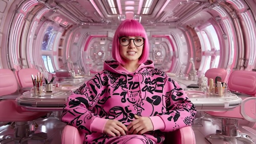
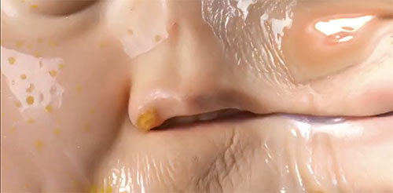
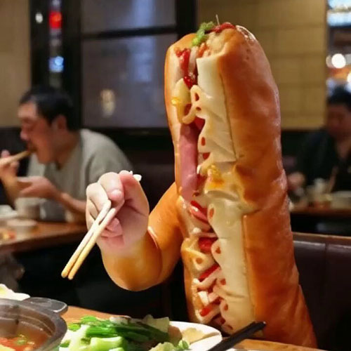
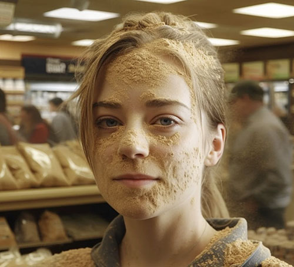
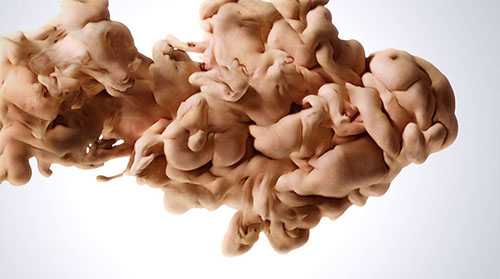

# Some AI Art & Artists

---

Trisha Code: 

* [*YouTube channel (441 daily videos)*](https://www.youtube.com/@TrishaCode/videos)
* [Dirty spaceship](https://www.youtube.com/watch?v=yEq6EaHtiIo)
* [As muppets](https://www.youtube.com/watch?v=_nRwC5IzMY8)
* [5 Things](https://www.youtube.com/watch?v=33MoV981eG0)

---

[@niceaunties](https://www.youtube.com/watch?v=aNldH5IIn3g)

---

[Jess MacCormack](https://jessmaccormack.com/artwork/ai/): 

* [portraits](https://x.com/musicalnetta/status/1871606217027801598)
* [fleshy](https://x.com/ClownVamp/status/1873416162350092616) (CW)
* [Twitter](https://x.com/JessMacAI)

---

[Sofia Crespo](https://sofiacrespo.com/)

---

[Elsa Carvalho](https://x.com/town_in_new)

---

AndrewJumpen: [animals eating noodles](https://x.com/_akhaliq/status/1812573686152450397); [hotdog eating Chinese food](https://x.com/_akhaliq/status/1811864979710107843)

---

Ainterestingaf: [Sawdust store](https://www.instagram.com/ainterestingaf/p/CrtBRWSowIJ/?img_index=1)

---

Scott Eaton, [Entangled II](https://vimeo.com/345875600)

---

Media artist David Szauder (b. 1976 in Hungary) has been teaching ‘AI’ courses at Moholy-Nagy University of Art and Design in Budapest. You might like his [Anatomy Sweaters](https://www.davidarielszauder.com/#/anatomy-sweaters/), which he uses AI to help design. He has created an [Instagram full of imaginary characters](https://www.instagram.com/davidszauder/):

and an [impressive series of self-portraits](https://www.davidarielszauder.com/#/me-myself-and-ai/) inspired by art history:

And then there's whatever is going on in [this Instagram channel by @billyfromthevoid](https://www.instagram.com/billyfromthevoid):

Finally, there is "[Fighting Windmills](https://verse.works/series/fighting-windmills-by-addie-wagenknecht)" by Addie Wagenknecht (2023). The artist as a deepfake confronts a deepfaked doppelgänger in a boxing ring, symbolizing the internal battle against self-sabotage and the weight of imposed standards.

---

## Reconstructing the Imaginary

### Reconstruction: Gaudí

[Kevin Slavin (2022) used MidJourney](https://twitter.com/golan/status/1544329926198939648) to visualize "real things that existed, or real events that happened, that have no visual record" — such as (architect) Antoni Gaudí's cardboard maquettes for the [Sagrada Familia](https://livingchurch.org/covenant/the-christmas-story-in-stone-the-nativity-facade-of-the-sagrada-familia/) cathedral, which were lost to fire.

---

### Reconstruction: Jodorowsky

Alejandro Jodorowsky was a visionary Chilean filmmaker, who in the post-psychedelic 1970s attempted to make a feature film version of “Dune.” He worked for two years with a super-team of artists, including Swiss artist H.R. Giger and France’s greatest comics artist, Jean "Moebius" Giraud, who drew more than 3,000 storyboard sketches. Jodorowsky presented his massive compendium of artwork to the Hollywood studios, who turned it down. Nevertheless, writes the NYTimes,

> This unfilmed film’s influence on our culture is nothing short of astounding. [Images from the “Dune” art bible escaped into the world. They can be experienced in movies such as “Blade Runner,” “Raiders of the Lost Ark,” “Prometheus,” “The Terminator” and even the original “Star Wars.” His “Dune” does not exist, yet it’s all around us.

Recently, the NYTimes asked Midjourney artist Johnny Darrell to prompt “production still from 1976 of Alejandro Jodorowsky’s Tron” to produce the illustrations in this NYTimes article, "[Alejandro Jodorowsky’s 1976 version of 'Tron'](https://www.nytimes.com/interactive/2023/01/13/opinion/jodorowsky-dune-ai-tron.html?unlocked_article_code=1.q04.m6NE.FeLY6VbnN9dB&smid=url-share)"

---
*EOF*