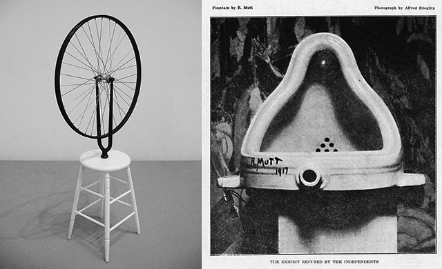
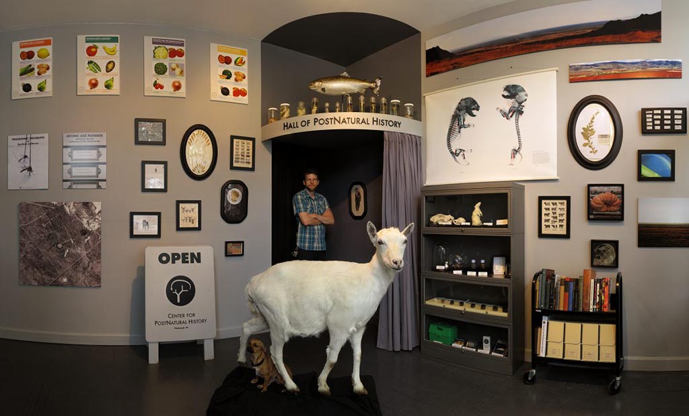
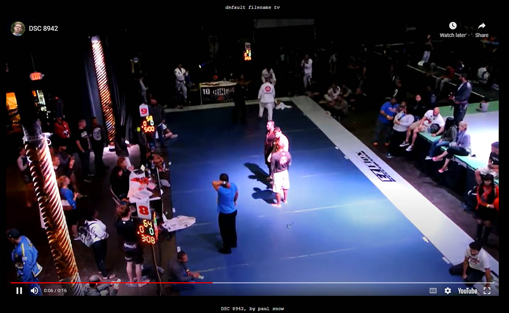
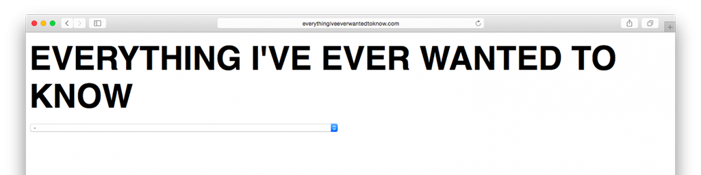
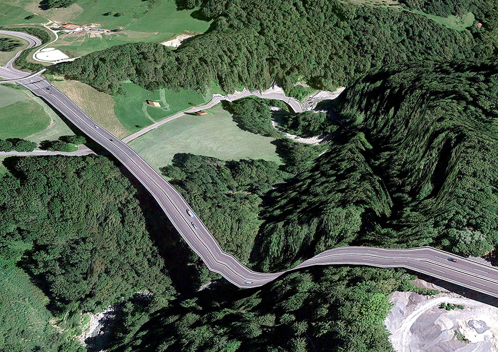
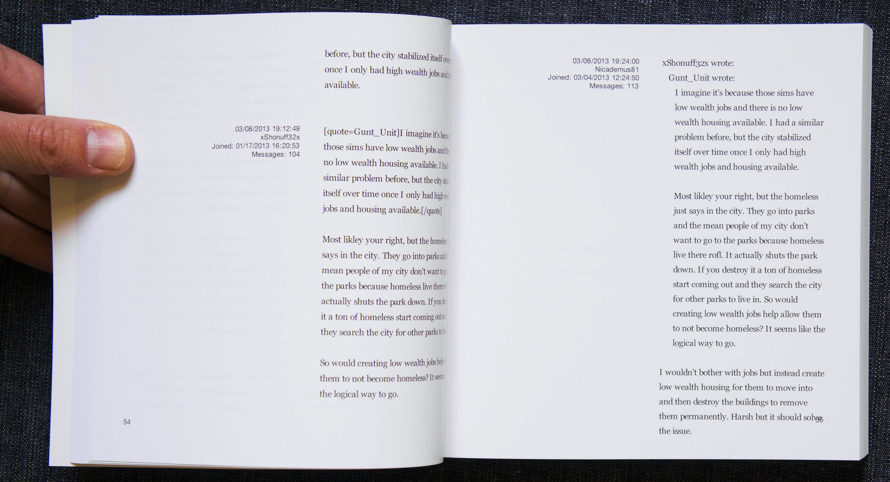
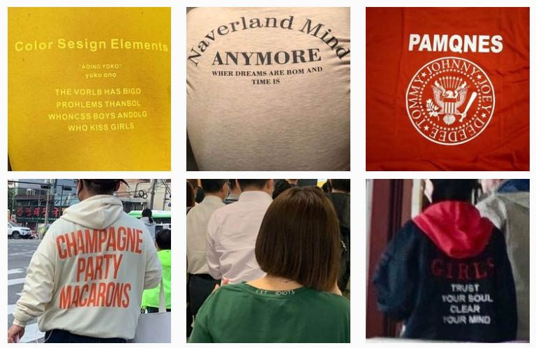
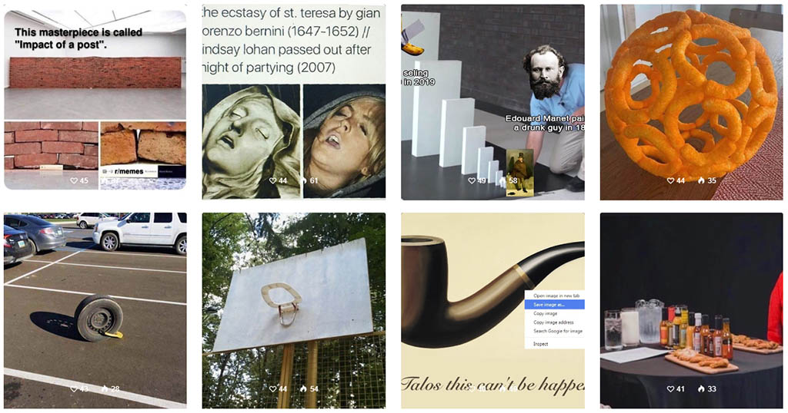
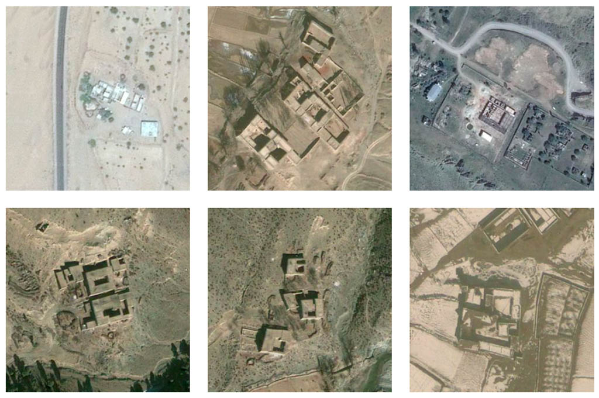
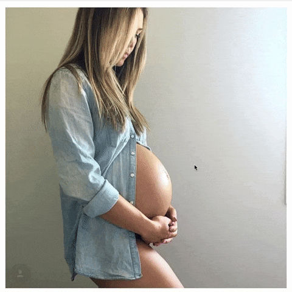

# Digital Curation / Internet Readymades

*by Golan Levin, Paolo Pedercini, & Johannes DeYoung* 
*CMU School of Art • Foundations of Electronic Media II*

---

**Contents:**

* Introduction
* From Curiosity to Collection
* What is a “found object”? How does it work?
* What is a “curator”? What do they do?
* Methodologies of Digital Readymade Curation 
  1. Aggregation as Pattern-Making
  2. Personal Data as Cultural Artifact
  3. Revealing Hidden Processes and Metadata
  4. Ideologies Embedded in Systems
  5. Language, Bootlegs, and Collective Authorship
  6. Memes, Power, and Visibility
  7. Absence, Omission, and Surveillance
* Some Projects by CMU Art Students

---

## Introduction

This unit is about **artistic authorship through selection and framing rather than fabrication**. We will treat the internet not primarily as a place for self-expression, but as a vast, already-existing cultural archive: messy, biased, automated, redundant, ideological, and full of overlooked artistic material. Our task is to operate as artist-researchers who enter that archive, identify something that matters, and makes it legible through careful collection and presentation.

This approach has a clear lineage. In the 20th century, artists associated with the Dada and Conceptual Art movements introduced the idea of the **readymade**: an ordinary object transformed into art through choice, displacement, and framing. In this logic, the artist becomes less a maker of things and more a **chooser**, **editor**, and **defamiliarizer**. Today, the internet multiplies this logic at a massive scale. Instead of urinals or bicycle wheels, we encounter search results, metadata, screenshots, filenames, glitches, comments, memes, surveillance imagery, absences, and repetitions. The raw material of contemporary culture is already there. Our work lies in how it can be gathered, structured, and interpreted.

Three ideas underlie this unit:

1. **Selection as authorship:** Choosing what to include, what to exclude, and where to draw boundaries is the primary creative act.
* **Curation as meaning-making:** Curating is not neutral organization; it is a way of bringing objects, systems, and ideas into relation so that a pattern or argument becomes visible.
* **Systems over artifacts:** Many of the strongest works here focus less on individual images or items and more on the processes, ideologies, and infrastructures that produce them.

The projects you will see in this lecture fall into several overlapping families of practice:

* **Taxonomic collections**, which reveal patterns through accumulation and comparison.
* **Procedural or rule-based aggregations**, where a simple constraint exposes larger cultural behaviors.
* **Critical excavations**, which surface political, social, or ethical dimensions embedded in digital systems.
* **Attention to absence**, where what is missing, excluded, or unrecorded becomes the subject.

Across all of these examples, the goal is the same: to make something newly visible by treating the internet itself as a site of inquiry. We can appreciate these projects, not just by how entertaining or ironic their findings are, but by how clearly their curation reveals a structure, bias, logic, or question that was not obvious before.

---

## From Curiosity to Collection

### When Noticing Turns into Research

*(Small-group discussions followed by brief share-out)*

Before we talk about curation, lt's start with a familiar impulse: noticing something, then following it further than expected. 

In small groups, **discuss**:

* Have you ever collected things (shells, toys, stamps, images, files, links, screenshots)? How did you know what *counted* and what didn’t?
* Think of a time you followed a trail online — a topic, pattern, community, obsession, or question that kept unfolding. What pulled you deeper? At what point did it stop feeling random and start feeling *structured*?

This unit asks you to turn that experience into a **deliberate artistic method**. In this unit, you will identify and conduct deep research into a narrow slice of the internet — some subculture, sub-genre, practice, or type of artifact you noticed — and treat it as material for research rather than distraction.

You will be asked to:

* **collect** a focused set of digital “objects,” traces, or artifacts that matter aesthetically, politically, historically, or anthropologically; and
* **curate** them into a public-facing form (online collage, presentation, or website) that reveals a pattern, argument, or system.

The goal is not to show everything you found, but to make something *legible* through selection and framing.

---

## What is a “found object”? How does it work?

 Marcel Duchamp: [*Bicycle Wheel*](https://en.wikipedia.org/wiki/Bicycle_Wheel) (1916) and [*Fountain*](https://en.wikipedia.org/wiki/Fountain_(Duchamp)) (1917).

A foundational strategy for this unit is the *found object* (from the French *objet trouvé*), also known as found art or the *readymade*, a term coined by Marcel Duchamp. Rather than emphasizing craft or originality, the Dadaist readymade defines a new type of (*conceptual*) authorship. Its core operations can be summarized as:

1. **Choose** an existing object — selection itself becomes the creative act.
2. **Displace or defamiliarize** the object by removing it from its normal context or use.
3. **Reframe through language or presentation**, to provoke new meanings and interpretations.

Under the logic of the readymade, the artist becomes a **critical selector, editor, and contextualizer**, rather than a "maker". Meaning emerges not from making something new, but from changing how something that already exists is seen and understood. 

 Claes Oldenburg, *[Ray Gun Wing](https://www.moma.org/calendar/exhibitions/1296/installation_images/8316)* (1970s) — a collection of scraps that look like ray guns.

Crucially, this often requires **typological thinking** — i.e. making **collections**. While a *single* found object may read as an accident or curiosity, a collection of *several* makes patterns visible, allowing repeated forms to become legible as *evidence* rather than exception.

This strategy has continued and expanded well beyond the 20th-century. In digital culture, the “objects” may be screenshots, search results, metadata, defaults, or glitches, but the underlying readymade logic remains the same. Here are some examples of internet-based readymade collections:

 [*The 9 Eyes of Google Streetview*](https://9-eyes.com/) by Jon Rafman (2008) is a post-photography project comprised of remarkable, jarring, and poignant images that the artist has found through exhaustive “travels” on Google Streetview.

 [*People selling mirrors on Craigslist*](https://www.instagram.com/p/DG5zDfSRuc3). A collection of screenshots from Craiglist.

 [*Walter Lewin, MIT Chalk Dotted Line Lecturer*](https://www.youtube.com/watch?v=B0LgaWUSzMI). An ASMR video "supercut" of distinctive-sounding moments isolated from lectures by a renowned physics educator. 

---

## What is a “curator”? What do they do?

In contemporary art, the roles of **artist, curator, and archivist frequently overlap**. Many artists now work not by producing discrete objects, but by collecting, organizing, and reframing existing materials in order to generate meaning. In this sense, curating is not secondary or administrative labor; it is itself a creative and intellectual practice.

As described in the article [*Curator as Artist as Curator*](https://curatingthecontemporary.org/2015/04/30/curator-as-artist-as-curator/):

> *The term “curator” has moved beyond any singular definition and now occupies a much broader sphere of activities, practices and professions. […] The curator does not merely display objects within a space, but “brings different cultural spheres into contact”, and as such acts as mediator between artworks, objects and ideas.*

Historically, curators were caretakers of museum collections, responsible for preservation, classification, and display. Today, curatorial practice extends far beyond the museum, especially into digital space. A curator does not simply choose objects; they **construct a framework** that determines how those objects are understood, what relationships are emphasized, and what questions are raised.

 
The [Center for PostNatural History](https://www.postnatural.org/) in Pittsburgh, founded by School of Art professor Rich Pell, exemplifies this expanded role. As a museum of genetically modified organisms, it does not create new organisms, but curates existing ones to provoke critical reflection on biotechnology and ethics.

At the same time, the word “curation” has undergone a semantic flattening. In digital culture, it often refers to routine acts of filtering, sorting, or reposting (“content curation”). This dilution is real — but it is also the terrain artists now work within.

> [Everyone’s a Curator Now](https://www.nytimes.com/2020/03/03/style/curate-buzzword.html) – When everything is “curated,” what does the word even mean? (NYT)

For this assignment, you are asked to **reclaim curation as a deliberate, critical act**. Your role is not to simply gather interesting material, but to shape a collection that makes an argument, reveals a pattern, or exposes a system. The curator’s primary medium is not the object, but the *relationships between objects*.

---

## Methodologies of Digital Readymade Curation

Let's see how artists have reacted to the proliferation of content on the internet, using a small number of recurring **strategies** to create internet readymades.

### 1. Aggregation as Pattern-Making

Some internet readymades work by collecting many similar items until repetition itself becomes meaningful. Individually, each item feels trivial; together, they reveal shared conventions, habits, or desires.

 *Tooth Gem Compilation* by Anonymous.

 
[*Working On My Novel*](https://x.com/WrknOnMyNovel) by Cory Arcangel (2014) collects tweets containing the phrase “working on my novel,” turning casual self-mythologizing into a collective, accidental literature.

 
Arcangel’s earlier project [*Sorry I Haven’t Posted*](https://coryarcangel.com/things-i-made/2010-020-sorry-i-havent-posted) (2010) aggregates blog posts apologizing for inactivity, revealing a shared anxiety produced by online self-publishing culture.

 
[*default filename tv*](https://everest-pipkin.com/#projects/defaultfilename.html) by Everest Pipkin (2019) collects YouTube videos that were uploaded from the camera without any changes to the default title of the video. The collection highlights accidental authorship and unintentional publication. [(*Website*)](https://default-filename-tv.neocities.org/)

 
[*I’m Google*](https://imgoogle.dinakelberman.com/) by Dina Kelberman (2011–) is an ongoing blog in which batches of found images that Kelberman culls from the internet are compiled into a long visual stream-of-consciousness.

 [*Google Faces*](https://www.itsnicethat.com/articles/onformative) by Onformative (2013) used face-recognition software to find satellite images containing what appeared to be faces.

 [*Satellite Collections*](https://www.jennyodell.com/satellite.html) by Jenny Odell (2009-2011) are collections of objects that the artist excerpted from satellite images:

> *In all of these prints, I collect things that I've cut out from Google Satellite View: parking lots, silos, landfills, waste ponds. The view from a satellite is not a human one, nor is it one we were ever really meant to see. But it is precisely from this inhuman point of view that we might be able to read our own humanity, in all of its tiny, repetitive marks upon the face of the earth. From this view, the lines that make up basketball courts and the scattered blue rectangles of swimming pools become like hieroglyphs that say: people were here.*

### 2. Personal Data as Cultural Artifact

Other projects turn inward, treating personal digital traces not as private material but as evidence of how platforms shape thought, memory, and attention.

 
[*EVERYTHINGIVEEVERWANTEDTOKNOW.COM*](https://anthology.rhizome.org/everythingiveeverwantedtoknow-com) by Martine Syms (2007) presents the artist’s Google searches over three years, transforming private curiosity into a portrait shaped by search engines. [[Site](https://everythingiveeverwantedtoknow.com/)]

 [*Internet Cache Self Portrait*](https://www.evan-roth.com/~/works/internet-cache-self-portrait-series/#hemisphere=east&strand=139), by Evan Roth (2013), is the artist's "uncensored stream of images passively collected through his daily Internet browsing. Faces of “friends” from social media exist side by side with corporate logos, mangled pieces of google maps, family photos and banner advertisements. The prints, composed of memories that were never intended to be saved, are archiving the seemingly incidental into something permanent."

### 3. Revealing Hidden Processes and Metadata

Some readymade collections focus not on content, but on the **invisible systems** that produce, organize, and maintain it. These works expose algorithms, edits, glitches, and edge cases.

 
[*Postcards from Google Earth*](https://www.postcards-from-google-earth.com/) by Clement Valla (2011–13) a collection of screenshots from Google Earth which reveal its inner workings. Valla writes:

> *I discovered strange moments where the illusion of a seamless representation of the Earth’s surface seems to break down. At first, I thought they were glitches, or errors in the algorithm, but looking closer I realized the situation was actually more interesting — these images are not glitches. They are the absolute logical result of the system. They are an edge condition—an anomaly within the system, a nonstandard, an outlier, even, but not an error. These jarring moments expose how Google Earth works, focusing our attention on the software. They reveal a new model of representation: not through indexical photographs but through automated data collection from a myriad of different sources constantly updated and endlessly combined to create a seamless illusion; Google Earth is a database disguised as a photographic representation. These uncanny images focus our attention on that process itself, and the network of algorithms, computers, storage systems, automated cameras, maps, pilots, engineers, photographers, surveyors and map-makers that generate them.*

 [*Search by Image, Recursively*](https://vimeo.com/34949864), by Sebastian Schmieg (2011) reveals the inner workings of algorithmic image search.

 [*Iraq War Wikihistoriography*](https://jamesbridle.com/works/iraq-war-wikihistoriography) by James Bridle (2010), also known as “The Iraq War: A History of Wikipedia Changelogs”, is a twelve-volume set of all changes to the Wikipedia article on the Iraq War. The books cover a five year period from December 2004 to November 2009, a total of 12,000 changes and almost 7,000 pages. His essay points out that although an article on Wikipedia may tell a “single” specific story, the edits show a process that involves the opinions and conflicting biases of each writer. In this respect Wikipedia offers two stories: one that is front-facing to the reader and one that reveals the behind-the-scenes editing, writing and creative process.

### 4. Ideologies Embedded in Systems

Here, artists collect vernacular traces to show how political assumptions are embedded in games, software, and interfaces.

 
[*How to get rid of homeless*](https://concrete-press.com/how-to-get-rid-of-homeless) by Matteo Bittanti (2015). Bittanti collected, selected, and transcribed thousands of messages exchanged by the forum members who first experienced and then tried to “eradicate” the phenomenon of homelessness that “plagued” SimCity. From surprise to despair, from shock to resignation, these posts highlight the pitfalls of simulation, the not-so-subtle effects of ideology on game design, and the interplay between play and society, politics and entertainment.

 [*barelyLegal*](https://www.onchanneltwo.com/CH2-barelyLegal) by CH2 (2015) is a series of desktop documentary Google-Map “drives” tracing routes to obtain safe legal abortions in the United States. For example, in 2015, an adult person who needed an abortion living in Odessa TX would need to travel to LasCruces NM for medical care — a five-hour drive.

### 5. Language, Bootlegs, and Collective Authorship

Some projects treat linguistic debris and cultural knockoffs as poetic or political material.

 
[*Shanzhai Lyric*](https://www.instagram.com/shanzhai_lyric/) by Ming Lin and Alexandra Tatarsky (2015–) collects bootleg English phrases, framing mistranslation and mimicry as collective, resistant authorship.

> *“Shanzhai [~Bootleg] Lyric is the name of both the project and the phenomenon we are trying to identify—an anonymously and collectively authored ongoing poem emerging out of the detritus of consumerism. […] an attempt at expressing solidarity with the aesthetic philosophy and politics of this hybrid English while not claiming ownership over the found phrases that we are gathering as our subject. We are less interested in producing our own bootlegs than in identifying shanzhai strategies and sharing them across various platforms […] Our aim is to place shanzhai lyrics in dialogue with other poetic and artistic lineages that also experiment with mimicry, wordplay, poetic plagiarism, and nonsense as subversive methods.”*

### 6. Memes, Power, and Visibility

Meme archives make explicit how humor, ideology, and circulation intersect.

 
[*Great Wall of Memes*](http://www.greatwallofmemes.com/) by Valentina Tanni (2012) presents memes as historical artifacts rather than disposable jokes.

 [*Online culture wars*](http://disnovation.org/ocw.php) by Disnovation (2018-19) is a map or visualization “of hundreds of politicized memes. It is designed as a discussion starter, intended to visualize and contextualize the ongoing online culture wars, and some of the main political references, actors, and influencers.”

 [*787 Cliparts by Oliver Laric*](https://www.youtube.com/watch?v=LK90lJCHlV4) (2008)

### 7. Absence, Omission, and Surveillance

Some readymades focus on what is missing, suppressed, or invisibly accumulated.

 
[*The Library of Missing Data Sets*](https://github.com/MimiOnuoha/missing-datasets/blob/master/README.md) by Mimi Onuoha (2016) catalogs data that *should* exist but does not, exposing structural bias through absence. [Example: “Trans people killed or injured in instances of hate crime”; more [here](https://github.com/MimiOnuoha/missing-datasets?tab=readme-ov-file#an-incomplete-list-of-missing-data-sets).]

> *“Missing data sets” are the blank spots that exist in spaces that are otherwise data-saturated. Wherever large amounts of data are collected, there are often empty spaces where no data live. The word “missing” is inherently normative. It implies both a lack and an ought: something does not exist, but it should. That which should be somewhere is not in its expected place; an established system is disrupted by distinct absence. That which we ignore reveals more than what we give our attention to. It’s in these things that we find cultural and colloquial hints of what is deemed important. Spots that we’ve left blank reveal our hidden social biases and indifferences.*

 
[*The Zooms*](https://www.youtube.com/watch?v=Xf9V-RNjXlg) by Sam Lavigne (2022) is a supercut of "Every instance of camera zoom-ins, automatically extracted from 600 hours of leaked police helicopter surveillance footage in Dallas, Texas". The work reveals how cinematic fantasy and real-world power reinforce each other.

 
[*There’s no such thing as a free watch*](https://www.jennyodell.com/museumofcapitalism_freewatch.pdf) by Jenny Odell (2017) traces the hidden labor and infrastructures behind a single object, demonstrating how deep research can emerge from a narrow starting point.

 [*Dronestragram*](https://www.instagram.com/dronestagram/) by James Bridle (2012-2015): posting Google Earth satellite images of the locations of drone strikes to Instagram. The images are posted (nearly) *as the strikes occur*, using location data collected from the Bureau of Investigative Journalism, which compiles and publishes daily reports from Pakistan, Yemen, and Somalia..

---

## Some Projects by CMU Art Students

 [*Eventide*](https://vimeo.com/84883569) by MFA student Cassandra C. Jones, 2004, is a video work comprised of photographs of other people's sunsets that the artist collected using Google image search. After aligning the suns and horizons, Jones sequenced them into a video that shows the sun setting, with the duration of an actual sunset. We see how the sunset figures into the popular collective imagination: romantic moments, etc.

 [*@the.circles.of.life*](https://www.instagram.com/the.circles.of.life/) (2017) by CMU art student Caroline Hermans. Hermans collected a dataset of Instagram pregnancy selfies, which she annotated with custom p5.js software in order to “find the center and radius of pregnancy.” For each portrait, Hermans overlaid a perfect circle showing the precise dimensions of the mother's baby bump. Described [here](https://ems.andrew.cmu.edu/excap17/author/caro/) and documented on Instagram [here](https://www.instagram.com/the.circles.of.life/).

 [*Sephora*](https://github.com/everestpipkin/datagardens/tree/master/students/khanniie/5_newDataSet) (2019) by CMU art student Connie Ye.

> *"A popular metric for a successful waterproof product is whether or not it can withstand tears and emotional turmoil. I remembered seeing a review giving an eyeliner 5 stars for surviving through a teary breakup, and I wanted to see if there would be more. Thus, for this project, I scraped Sephora’s website for reviews, and filtered through them for reviews mentioning 'crying'.”*

 [*Chiropractic Neck Cracking Supercut*](https://www.youtube.com/watch?v=mc_J4wbwKxY) by Reiley Nymeyer, CMU, created for *Foundations of Digital Media*, 2021. Nymeyer, a sophomore, created a "supercut" of disturbing moments from YouTube videos about chiropracty. 

 [*Breaking the [glass] Screen*](https://anishabaid.com/breaking-the-glass-screen) (2021) by art MFA student Anisha Baid is “a video presentation articulating gendered frustrations with the computer interface using a collection of found clipart and stock images. The video is made using appropriated corporated aesthetic strategies usually used in presentations about workplace ethics, sexual harassment and work-life balance.” [[more](https://empowering-women.net/about-breaking-the-screen-2020/)]

### Websites

Student website projects from Spring 2025: 

* [Shit Duo Says](https://mmm.page/anqic/shitduosays) by Anqi
* [Pant-Theon](https://floatingtable.mmm.page/pant-theon) by Owen
* [Hoarded Notes](https://hoardednotes.wordpress.com/) by Zahra
* [a collection of pictures of water](https://sonyahamid.mmm.page/collection-of-water) by Sonya
* [peculiar and vulgar code on github](https://mano.raje.sh/peculiar-code) by Mano
* [I HATE MY BANGS](https://munin.hotglue.me/) by Munin
* [San Michele Arcangelo](https://sanmicheleali.wordpress.com/) by Noam

---

<!--
Old links: 
* https://github.com/golanlevin/60-120-old/tree/main/2025/lectures/digital_curation
* https://ems.andrew.cmu.edu/2022f/daily-notes/unit-4-internet-readymades/index.html
* https://github.com/golanlevin/60-120-old/tree/main/2025/assignments/digital_curation
* https://github.com/golanlevin/ExperimentalCapture/blob/master/docs/typologies.md
-->