# Realtime Tracking in Interactive Art

*This is a very brief introduction to how face-tracking, hand-tracking, and body-tracking have been used in interactive art.* 

For more information or additional projects related to the materials shown here, see: 

* [**Expanded Body**](https://github.com/golanlevin/lectures/tree/master/lecture_expanded_body)
* [**Shadow Play**](https://github.com/golanlevin/lectures/tree/master/lecture_shadow)
* [**Faces in New Media Art**](https://github.com/golanlevin/lectures/tree/master/lecture_face)

**Contents:**

1. Early Histories of Motion Capture 
2. Body-Tracking in Interactive Art
3. Face-Tracking in Interactive Art
4. Hand-Tracking in Interactive Art

---

## Motivation

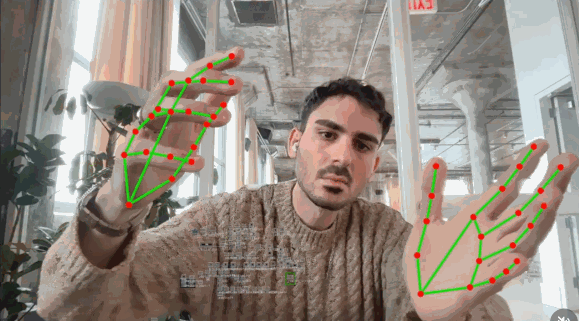 *TouchDesigner experiment by @ojrgb (2025)*

You may have seen some recent projects like this on Instagram. All were made with TouchDesigner. What is the cultural and technological history of this kind of work? 

* [https://www.instagram.com/p/DVTr63sjDLw](https://www.instagram.com/p/DVTr63sjDLw)
* [https://www.instagram.com/p/DUBEQfFjLrY](https://www.instagram.com/p/DUBEQfFjLrY)
* [https://www.instagram.com/p/DVBwfPnjBmJ](https://www.instagram.com/p/DVBwfPnjBmJ)
* [https://www.instagram.com/p/DVn2ryfkSOj](https://www.instagram.com/p/DVn2ryfkSOj)
* [https://www.instagram.com/p/DVEZzEwjCvl](https://www.instagram.com/p/DVEZzEwjCvl)
* [https://www.instagram.com/p/DW0zEmQgEgH](https://www.instagram.com/p/DW0zEmQgEgH)

---

# 1. Early Histories of Motion Capture 

In the 1880s, improvements to photographic technology (such as electrical timers, and faster chemicals allowing shorter exposure times) enabled the first "**chronophotography**" studies of human and animal motion.

[**Étienne-Jules Marey**](https://en.wikipedia.org/wiki/%C3%89tienne-Jules_Marey) (1830-1904) was a French scientist and physiologist. In 1883, he developed the first *motion capture suit*. As is often the case with new technologies, the earliest motion capture systems were made for military purposes. France had recently lost the Franco-Prussian war against Germany; Marey convinced the French government to fund his research, on the grounds that it would help design better exercises to train soldiers.

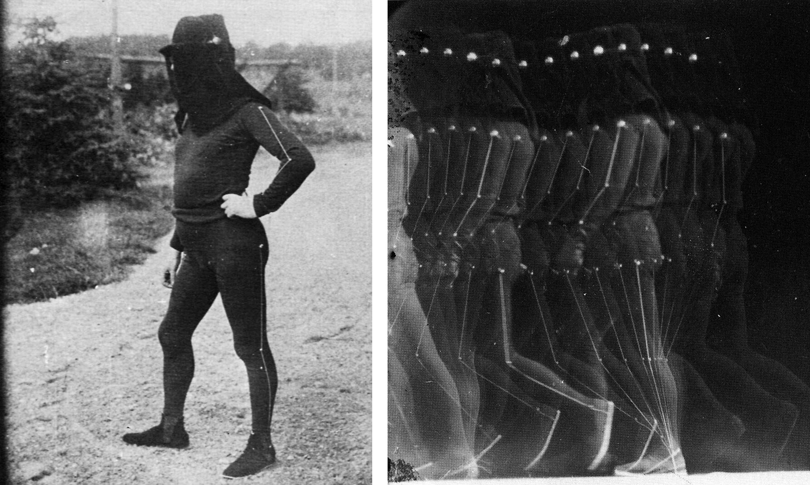

Around 1915 in the USA, [**Lillian and Frank Gilbreth**](https://www.youtube.com/watch?v=g3sj7G7KSSU) developed a different technique for conducting time-motion studies. Inspired by Henry Ford's assembly lines, the Gilbreths had the goal of reducing repetitive work cycles to their shortest and most efficient sequence of gestures. Their [system](http://we-make-money-not-art.com/the_chronocyclegraph/) was essentially a long-exposure or time-lapse phorograph of tiny lights attached to moving human bodies.

[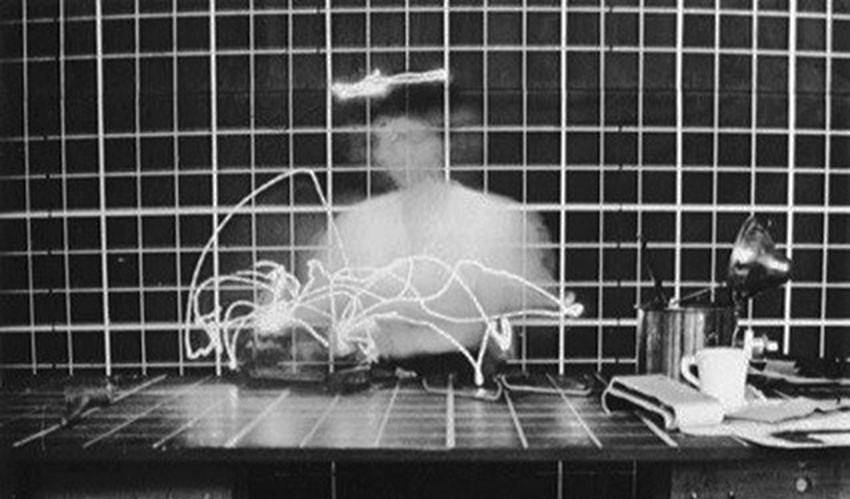](http://we-make-money-not-art.com/the_chronocyclegraph/)

During World War I, the Gilbreths' research was supported by the US government, which wanted to find the fastest way for a soldier to disassemble and clean a gun. The Gilbreths ended up revolutionizing hospital design; they were the first to propose that it would be more efficient for a nurse to assist a surgeon, by handing them surgical instruments when called for.

In the arts, the visual language of chronophotography greatly inspired the Cubists, who aimed to present moving subjects. An example is Marcel Duchamp's *Nude Descending a Staircase* (1912), which was inspired by the motion studies of Marey's American competitor, Eadweard Muybridge (1880s).

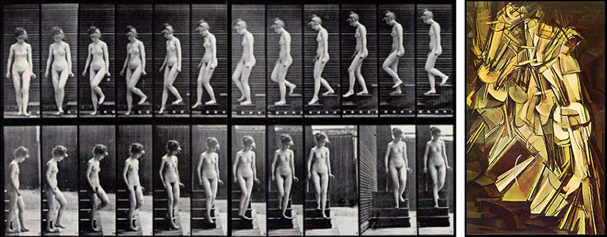

*Artists* also used visual abstraction to understand human movement. This can be seen in the work of Oskar Schlemmer (1888-1943), a sculptor and choreographer who directed the design program of the theater department at the German Bauhaus School in the 1920s. In his performances, actors are transformed into geometrical shapes. He developed his analytic [*Stelzenläufer*](https://www.youtube.com/watch?v=0j0x325uR8s) (Slat Dance) in 1927, in which human movement becomes clear through visual simplification. 

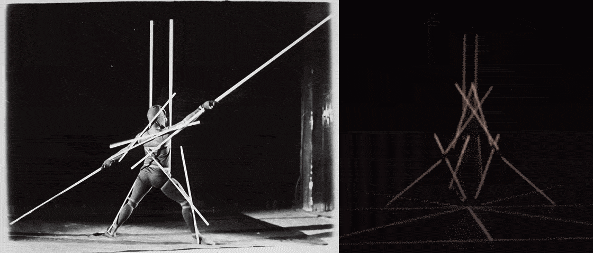

Of course you're aware of a long history of motion capture in *entertainment*, in which the movements of actors were used to scaffold the behavior of animated characters. Andy Serkis performing Gollum in *The Lord of the Rings* (2000) is a good example. We're not going to focus on this, since the rest of this lecture is primarily about motion capture for *real-time* (interactive) media.  

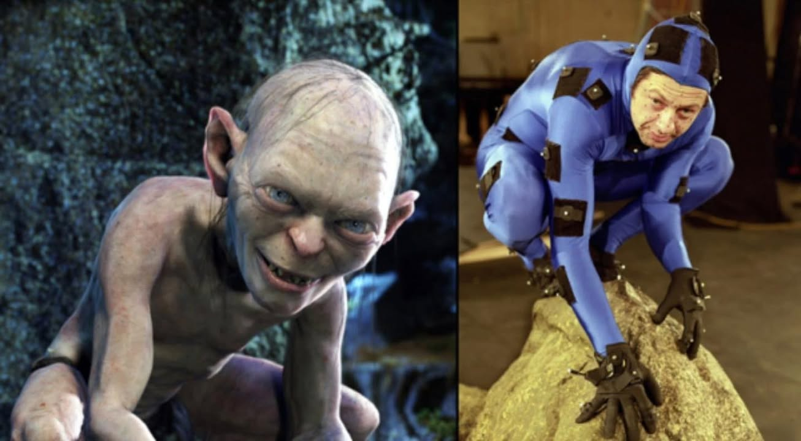

That said, it's worth knowing that motion capture in the movies predates the use of computers by many decades. An important early technique for motion capture was *rotoscoping*, patented by cartoon director Max Fleischer in 1917 and still used today, in which an animator hand-traces the performer's body for each frame. Here you can see jazz musician Cab Calloway being rotoscoped for a Fleischer animation in 1932: 

---

# 2. Body-Tracking in Interactive Art

Myron Krueger's landmark [*Videoplace*](https://www.youtube.com/watch?v=A6ZYsX_dxzs&t=140s) (1974-1989) was not only one of the first interactive artworks to use a camera; it was one of the first interactive artworks to use a computer, ever. Krueger was farsightedly creating full-body interactions at a time before the personal computer existed, when most computers did not even have mice. The installation had many different scenes. 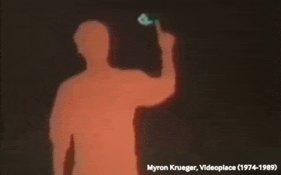

<table>
  <tr>
    <td>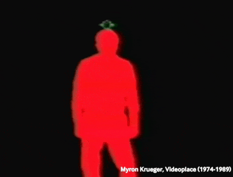</td>
    <td>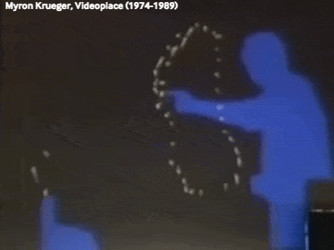</td>
  </tr>
</table>

Scott Snibbe's conceptually-oriented [*Boundary Functions*](https://www.youtube.com/watch?v=5wA3lKcDrlM) installation (1998) divides the floor into participants' "territories" using the Voronoi partitioning algorithm. It's a good example of overhead body tracking. 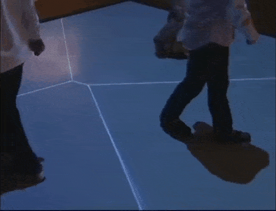

Camille Utterback's [*Text Rain*](https://www.youtube.com/watch?v=f_u3sSffS78&t=18s) (1998) presents characters in a poem that settle on the silhouettes of participants. 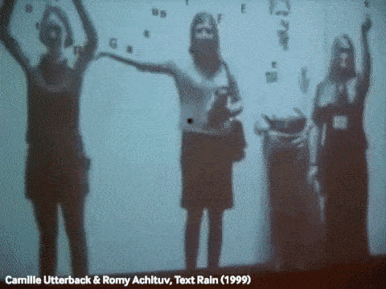

In Golan Levin & Zach Lieberman's performance [*Messa di Voce*](https://www.youtube.com/watch?v=STRMcmj-gHc&t=5s) (2003), projected graphics respond to both the vocal noises and body movements of the singer-performers. 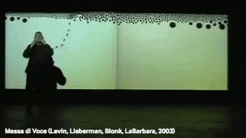

Philip Worthington, [*Shadow Monsters*](https://www.youtube.com/watch?v=ShHQHAlZ7fA) (2004) 
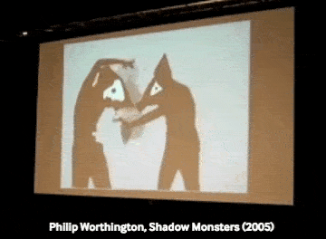

[*Mortal Engine*](https://www.youtube.com/watch?v=CHKLr_pvj2I&t=90s) (2008) by Australian dance studio Chunky Move is a performance with sound-responsive, body-tracked real-time augmented projections. 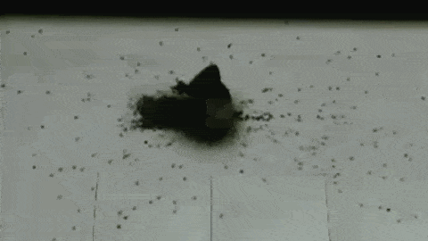

Karolina Sobecka & James George's street-level installation [*Sniff*](https://vimeo.com/13791894) (2011) presents a virtual dog that responds to the posture and proximity of the bodies of passersby. 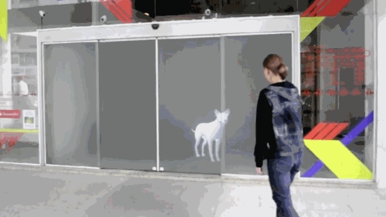

Chris Milk's interactive installation [*Treachery of Sanctuary*](https://www.youtube.com/watch?v=_2kZdl8hs_s) (2012) presents three dreamlike scenes: the body turns into a bird; the body is consumed by birds; the body dissolves into birds. 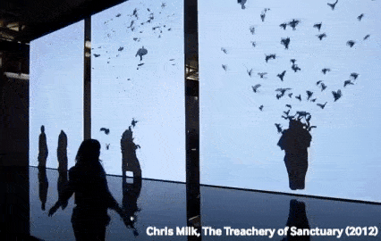

Klaus Obermaier's [*Ego*](https://www.youtube.com/watch?v=KzDifurF9wQ) installation (2015) demonstrates that compelling work can be made with simple graphics. 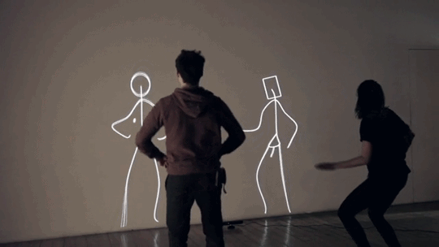

### Some Body-Tracking Experiments by CMU Students

*These projects were created by BFA and BXA undergraduate students in intermediate-level classes.*

Kate Chaudoin & Kaleb Crawford's [motion capture study](https://ems.andrew.cmu.edu/2016-60212/krawleb/11/15/krawleb-mocap/) (2016) explores how a digital body allows for operations like copy-paste. Here, the participant's arm is duplicated and translocated in real-time. 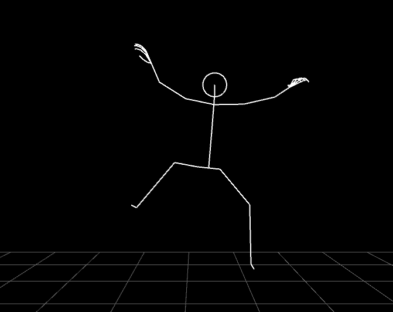

Kai Okorodudu created [*Body Weave*](https://youtu.be/LN5vuD0LR7A) (2024), in which the participant can create interesting configurations of a virtual rope by weaving it around their joints. 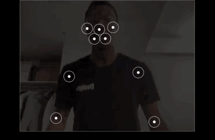

Nik Diamant's [*MoCap Head*](https://www.youtube.com/watch?v=LVUQ33xXdxc) (2019) is controlled in real-time by the limbs of his body. 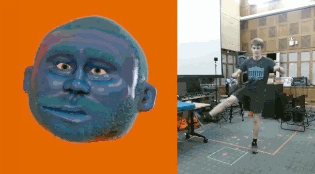

---

# 3. Face-Tracking in Interactive Art

Zach Lieberman's [*Más Que la Cara*](https://zachlieberman.medium.com/m%C3%A1s-que-la-cara-overview-48331a0202c0) (2016) is a public installation that transforms the faces of passersby with imaginative virtual masks. Zach has made many other [related experiments](https://www.instagram.com/p/BeeP2yaATEd/). 
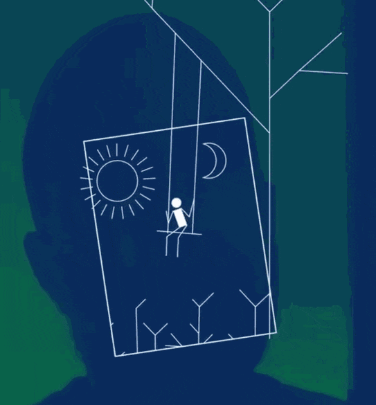

Nobumichi Asai's [*Omote*](https://vimeo.com/164322592) (2014) is a live performance that combines realtime face tracking with augmented projection. 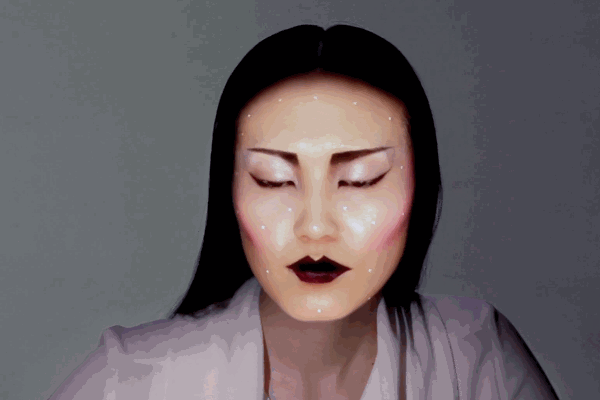

In Christian Moeller's [*Cheese*](https://www.youtube.com/watch?v=B61CEiPWzGk) (2003), six actresses each try to hold a smile for several hours. Their smiles are scrutinized by an emotion recognition system and whenever the display of happiness fell below a certain threshold, an alarm alerted them to show more sincerity. 

Mary Huang's [*TypeFace 2*](https://vimeo.com/9587564) (2010) uses the expression on a participant's face to control expressive parameters of a font. 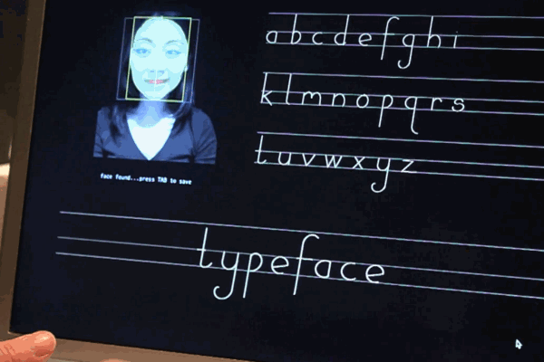

Nexus Studio's [*Face Pinball*](https://twitter.com/nexusstories/status/1023984741001965571) (2018) game is controlled by the player's face, but takes liberties with the customary positions of the eyes, nose, and mouth. 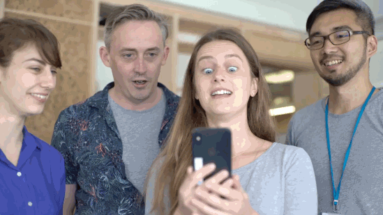

### Some Face-Tracking Experiments by CMU Students

*These projects were created by BFA and BXA undergraduate students in intermediate-level classes.*

Nancy Zuo made [*Kiss Mirror*](https://www.youtube.com/watch?v=d8Unf7LvX_g) (2023), which leaves lipstick stains when you kiss. 

Darcy Cao's [*Face Experiment*](https://ems.andrew.cmu.edu/2016-60212/darca/10/15/darca-faceosc/index.html) (2016) turned one's frontal face into an uncanny profile. 

Lingdong Huang's [*Face Powered Shooter*](https://vimeo.com/187285292) (2016) was a 3D game entirely controlled by the user's face. Open your mouth to shoot. 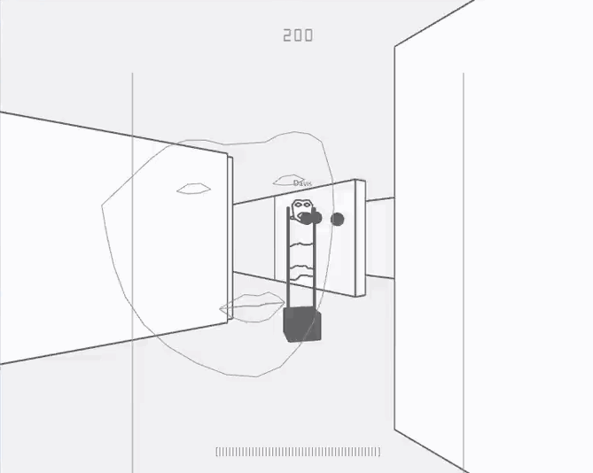

Max Hawkins's [*FaceFlip*](https://vimeo.com/10191761) (2011) was a software intervention in ChatRoulette, a "random video chat" app (similar to Omegle or [Monkey.App](https://www.monkey.app/)) that connected users for live one-on-one video chat with a stranger. Instead of connecting people on the other end with the local camera, Max's software instead connected them to his own custom video mirror — in which their own faces were flipped upside-down. 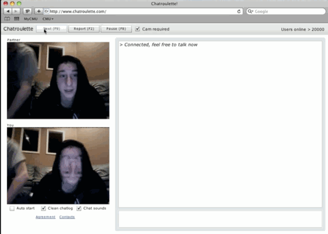

---

# 4. Hand-Tracking in Interactive Art

Christine Sugrue's interactive installation [*Delicate Boundaries*](https://csugrue.com/delicateboundaries/) (2007) presents an intimate virtual world in which animated critters appear to crawl off the screen onto the participant's hand. 

Emily Gobeille & Theo Watson's [*Puppet Parade*](https://vimeo.com/34824490) (2012)  allows participants in the rear to control large virtual puppets with their hands, while participants closer to the projection can "feed" the virtual puppets with their bodies. 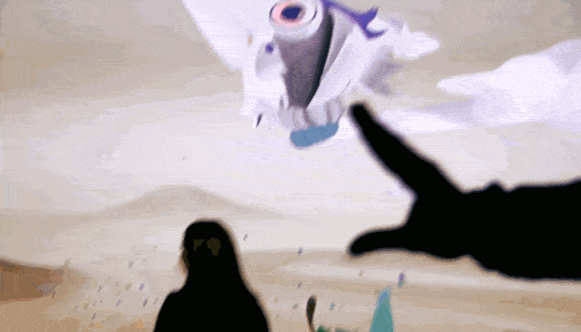

The [*Augmented Hand Series*](https://flong.com/archive/projects/augmented-hand-series/index.html) (2014) is a real-time interactive software installation by Golan Levin, Kyle McDonald, and Christine Sugrue. It presents playful, dreamlike, and uncanny transformations of its visitors’ hands. 

[Leap Motion Cat Explorer](https://www.youtube.com/watch?v=9KCA44GZRQg) (2019) allows the participant to use their hand as a tool, to interactively examine a virtual 3D model. 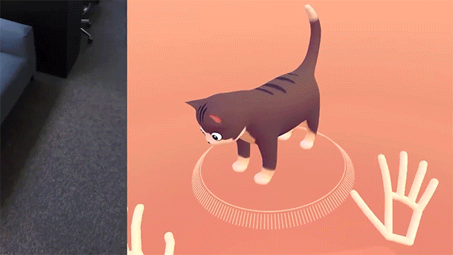

### Some Hand-Tracking Experiments by CMU Students

*These projects were created by BFA and BXA undergraduate students in intermediate-level classes.*

Alex Tan's [*Finger Lickin'*](https://www.youtube.com/watch?v=ZZ-MfS9EKx8) (2023) allows you to chew your fingers off. It combines hand tracking and face tracking with springy physics. 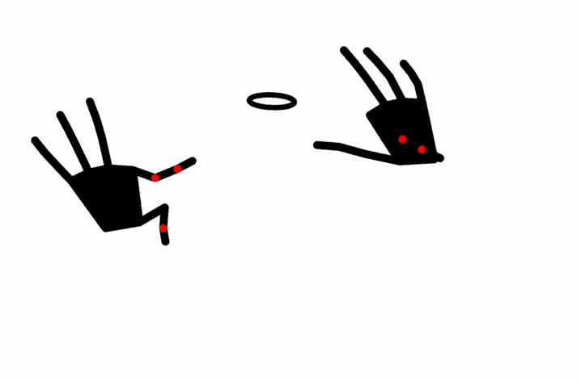

---