# Responsive Environments

---

## Art in Flux: Things and Events

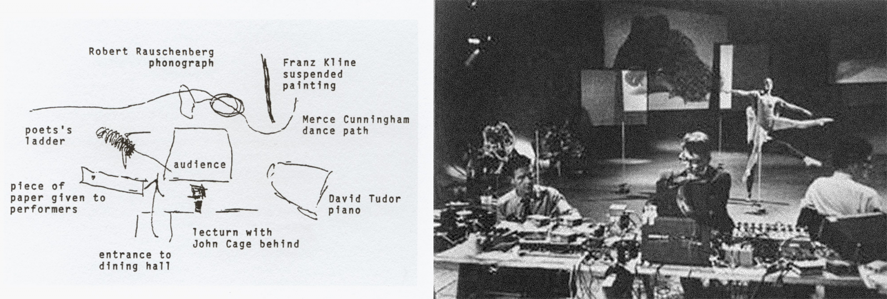
**John Cage**, *Theater Piece no. 1* (1952)
> *“I am interested in any art not as a closed-in thing by itself but as a going-out one to interpenetrate with all other things, even if they are arts too. All of these things, each one of them seen as of first importance; no one of them as more important than another. In theater, as Artaud points out, it is death to place literature in the only central position; and so I do not agree that ‘film is a visual form’. The images don’t interest me any more than the sound. Nor am I interested in the artistic arrangement of sound to go with or against the images. All that comes about in a successful such situation is a composite of two, not an imitation … of nature in her manner of operation as, in our time, her operation is revealed.”* 
> 
> *John Cage — “On Film”, 1956, in John Cage: An Anthology, ed. Richard Kostelanetz (New York: Da Capo, 1991), 115. Quoted in Kay Larson’s Where the Heart Beats: John Cage, Zen Buddhism, and the Inner Life of Artists, (New York: Penguin Press, 2012), 255.*

*Declared the first happening, the performance (referred to by many as “The Event”) took place in August 1952 at Black Mountain College. Later named “Theater Piece No. 1”, it was one of John Cage's first large scale collaborative, multimedia performances, created and performed while he was teaching at Black Mountain College in North Carolina. It involved several simultaneous performance components – all orchestrated by Cage – and chance played a determining role.*

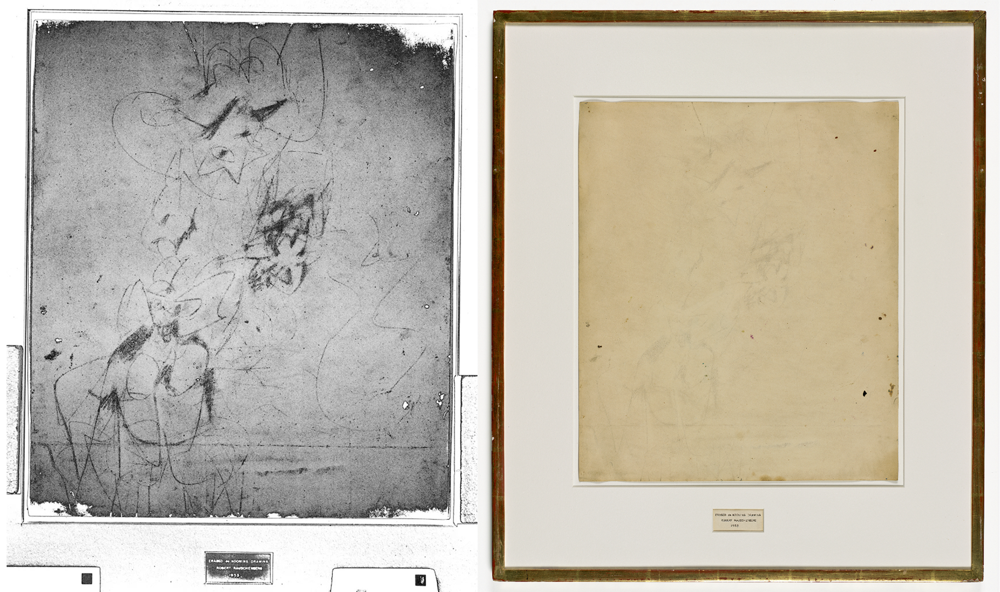
**Robert Rauschenberg**, *Erased de Kooning Drawing* (1953)
> *From 1951 to 1953, Robert Rauschenberg made a number of artworks that explore the limits and very definition of art. These works recall and effectively extend the notion of the artist as creator of ideas, a concept first broached by Marcel Duchamp (1887–1968) with his iconic readymades of the early twentieth century. With Erased de Kooning Drawing (1953), Rauschenberg set out to discover whether an artwork could be produced entirely through erasure—an act focused on the removal of marks rather than their accumulation.*
> 
> *Rauschenberg first tried erasing his own drawings but ultimately decided that in order for the experiment to succeed he had to begin with an artwork that was undeniably significant in its own right. He approached Willem de Kooning (1904–1997), an artist for whom he had tremendous respect, and asked him for a drawing to erase. Somewhat reluctantly, de Kooning agreed. After Rauschenberg completed the laborious erasure, he and fellow artist Jasper Johns (b. 1930) devised a scheme for labeling, matting, and framing the work, with Johns inscribing the following words below the now-obliterated de Kooning drawing.*
> 
> *The simple, gilded frame and understated inscription are integral parts of the finished artwork, offering the sole indication of the psychologically loaded act central to its creation. Without the inscription, we would have no idea what is in the frame; the piece would be indecipherable.*
> 
> *[https://www.sfmoma.org/artwork/98.298/](https://www.sfmoma.org/artwork/98.298/)*

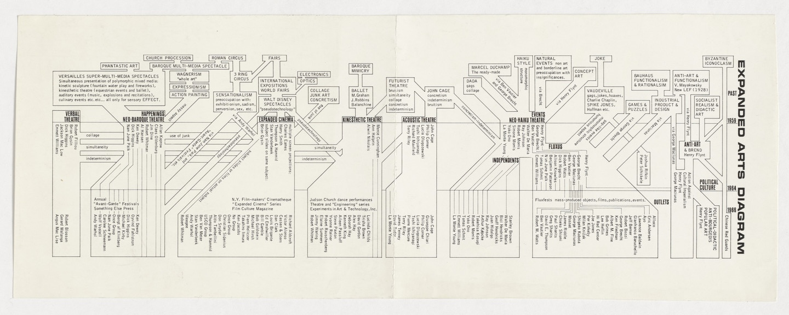
[**George Maciunas**](https://www.youtube.com/watch?v=9nmoolpEhGk), *Expanded Arts Diagram* (1966); [*"George: The Story of George Maciunas & Fluxus"*]() (2019)
> *"Maciunas’s methodical mapping of the history of Fluxus, consist of labyrinthine historical flowcharts that substitute a timeline’s conventional horizontal axis with a splintered and networked vertical arrangement of names, artworks, performances, concepts, and places.*
> 
> *These documents visualize a decisive rupture in the art-historical record and usher in a new way of understanding one’s work in relation to that of others and in the context of history."*
> 
> [*https://walkerart.org/collections/publications/art-expanded/introduction/*](https://walkerart.org/collections/publications/art-expanded/introduction/)

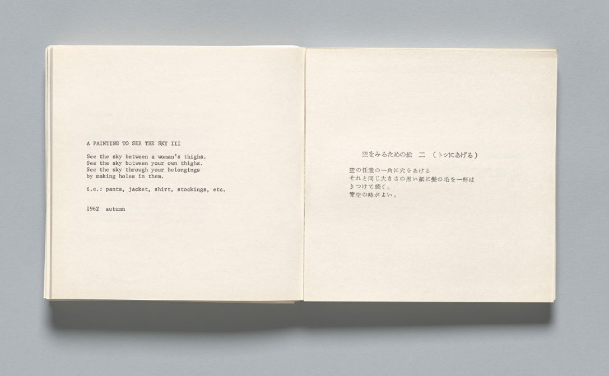
**Yoko Ono**, [*Grapefruit*](pdf/Yoko-Ono-Grapefruit.pdf) (1964)
> *Originally published in 1964, Yoko Ono’s Grapefruit: A Book of Instructions and Drawings is a foundational work of conceptual art. This artist’s book contains “event scores,” instructions that the reader may choose to follow in order to perform a proposed piece of art.*
> 
> [*- Smithsonian Libraries*](https://library.si.edu/donate/adopt-a-book/grapefruit)

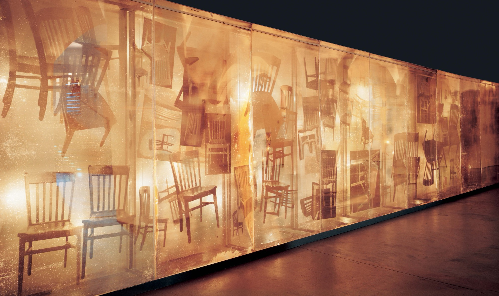
**Robert Rauschenberg**, *[Soundings](https://www.youtube.com/watch?v=28Cf8JnuDK4)* (1968)
> *Through his participation in the Swiss artist Jean Tinguely’s kinetic environment, "Homage to New York" in 1960, Rauschenberg began working with Bell Laboratories research scientist, Billy Klüver. In collaboration with Klüver, Rauschenberg realized some of his most ambitious technological works, including the sound-producing sculptural environment, "Oracle" (1962–65), as well as "Soundings" (1968), a monumental light installation responsive to ambient sound. Both works were meant to be experienced by the audience spatially and appeal to the senses beyond the purely visual.*
> 
> [*- Robert Rauschenberg Foundation*](https://www.rauschenbergfoundation.org/artist/art-and-technology-1959-98)

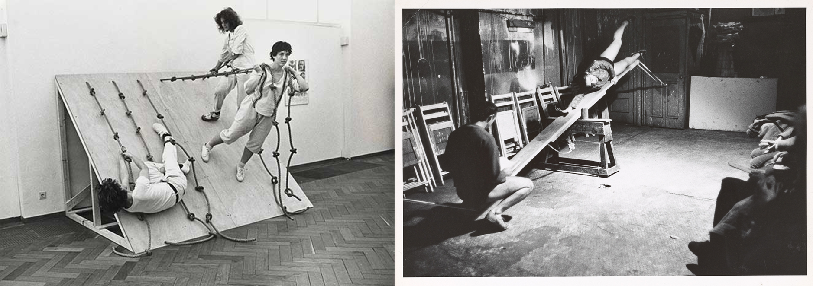
**Simone Forti**, [*Dance Constructions:*](https://www.youtube.com/watch?v=wBaRsjHwn0E) *Slant Board* (left, 1961); *See Saw* (right, 1960)
> *Simone Forti began making what she called “Dance Constructions” in 1960 by combining ordinary movement, like walking, sliding, and climbing, with everyday objects like ropes and plywood boards. In the original version of Seesaw, Yvonne Rainer and Robert Morris moved up and down a long plank, balancing their bodies in relation to one another.*
> 
> [*- Ana Janevski, MoMA Audio Archives*](https://www.moma.org/audio/playlist/53/780)

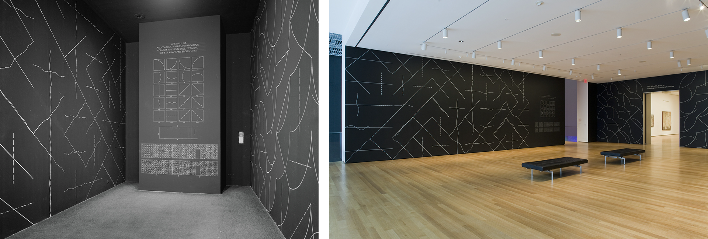
[**Sol LeWitt**](https://www.youtube.com/watch?v=qIHi8FOtW0Q), *Wall Drawing #260, On Black Walls, All Two-Part Combinations of White Arcs from Corners and Sides, and White Straight, Not-Straight, and Broken Lines* (1975); [*"Installing Sol Lewitt: A Wall Drawing Retrospective"*](https://www.youtube.com/watch?v=c4cgB4vJ2XY), *MASS MoCA* (2008)
> *Sol LeWitt’s wall drawings are comprised of instructions that enable others to execute them when the work is to be exhibited. The only permanent, concrete form of [Lewitt's drawing] is a set of typewritten guidelines and a certificate of authenticity signed by the artist. The instructions often mark the end of the artist’s involvement in the realization of a work and separate the conception of the work from the craft of making it.*
> 
> [*https://whitney.org/collection/works/25530*](https://whitney.org/collection/works/25530)

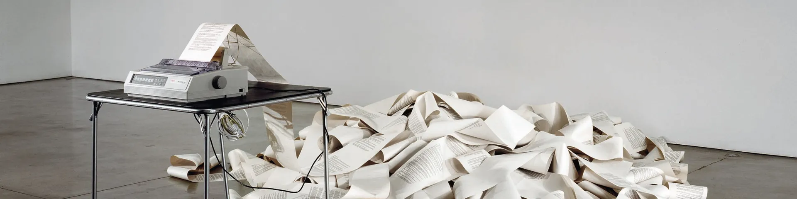
**Hans Haacke**, [*News*](https://www.youtube.com/watch?v=aVp-ZXPu3gk) (1969)
> *Hans Haacke’s (b. 1936) News was first realized in 1969, for the Prospect 69 exhibition in the Kunsthalle, Düsseldorf. Haacke presented the concept of the work as follows: A telex machine installed in the Düsseldorf Kunsthalle prints all of the news communicated by the German press agency DPA. The printouts were put on display for further reading one day after being delivered, and on the third day, the rolls of paper were labeled and dated, then stored in plexiglass containers.*
> 
> *The work was reconstructed in 2005 for an exhibition at the Paula Cooper Gallery in New York. In this manifestation, the telex machine was replaced with a dot matrix printer that was fed from a software program that gathered news from Really Simple Syndication (RSS) feeds via the Internet. The San Francisco Museum of Modern Art acquired News in 2008 and displayed it in this form for the exhibit The Art of Participation: 1950 to Now. In 2017, the museum exhibited it again for the Nothing Stable Under Heaven exhibition.*
> 
> [*Mark Hellar and Daniel Finn, Electronic Media Review, Volume 6: 2019-20*](https://resources.culturalheritage.org/emg-review/volume-6-2019-2020/hellar/)

---
## Network Aesthetics

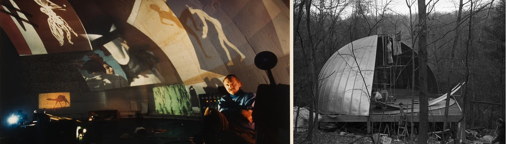
**Stan VanDerBeek**, *[Movie Drome](https://www.youtube.com/watch?v=GUn6ssvNj9Q&t=5s)* (left, 1965); *Movie-Drome under construction, Stony Point, New York* (right, 1964)
> *The variable nature of Expanded Cinema-understood here as artworks that employed multiple audio and visual projection sources in an intimate environment-chafed against object-based art's engagement with originality and singularity. Instead Expanded Cinema projects and events prioritized the principles of collaboration and transparency of process in order to illuminate the broader media ecology within which these types of art works circulated. More significantly, [the] emergence of Expanded Cinema reflected visual art's adoption of the specific semantic codes and modalities ushered in by cybernetics and systems theory.*
> 
> *- Gloria Sutton, The Experience Machine: Stan VanDerBeek's Movie-Drome and Expanded Cinema, p08 (2015)*

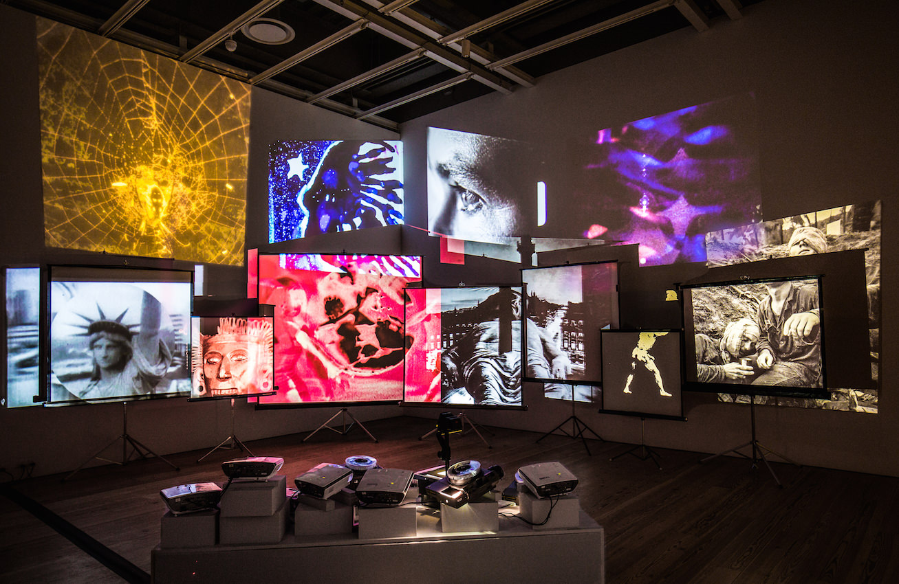
**Stan VanDerBeek**, *Movie-Mural* (1965-68)
> *"VanDerBeek's Movie-Drome pointed to the notion of a programmable apparatus-executing a variety of operations based on codes, instructions, or directions set by the artist-linking it more to the basic traits associated with computer processing rather than the cinematic apparatus, or any type of film-projection design.*
> 
> *Beyond simply providing a metaphor for plurality, the term 'multimedia' suggests that meaning is produced out of the more complicated relationship in which the discrete forms of film, video, sound, and dance are mediated among and through one another. That is to say, media is subject to a process of remediation. This also pressures the paradigm of fidelity that subtends much of time-based work. Remediation can be thought of as the simultaneous synthesis of various functions and characteristics from different media."*
> 
> *- Gloria Sutton, The Experience Machine: Stan VanDerBeek's Movie-Drome and Expanded Cinema, p138 (2015)*

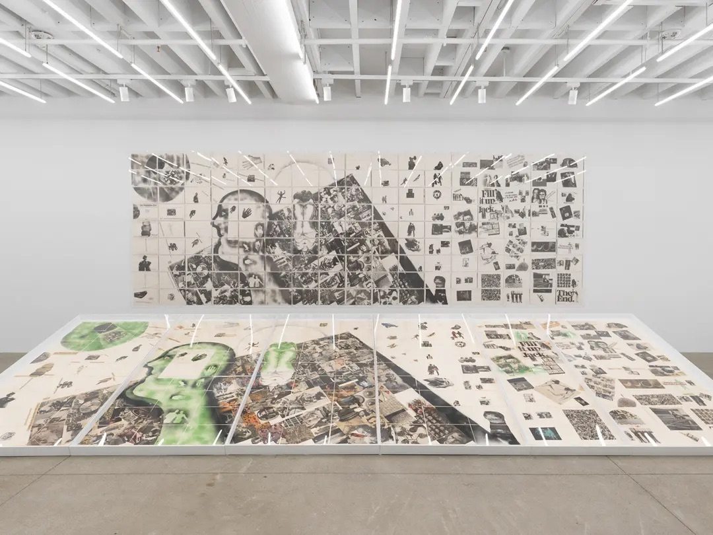
**Stan VanDerBeek**, *Panels for the Walls of the World: Phase II* (1970). 

> *Panels for the Walls of the World: Phase II (1970) is a grid of 153 sheets of paper totaling six feet by twenty. It was conceived to be transmitted from MIT as individual sheets of facsimile to its exhibition destination, long before “fax” became a commonplace verb (Xerox introduced the technology in the mid-1960s with advertising copy that read “Mail Letters Over the Phone!”) and daily implement.* 
> 
> *- Stephen Frailey, ["Stan VanDerBeek: Transmissions", The Brooklyn Rail. April 2024](https://brooklynrail.org/2024/04/artseen/Stan-VanDerBeek-Transmissions/)*
> 
> *"Panels for the Walls of the World, was an ongoing project in which collaged newspapers, drawings, and found images were scanned and faxed to the Smithsonian from other institutions including the Center for Advanced Visual Studies. This project developed from a set of fax murals that VanDerBeek started experimenting with in 1969 at the start of his residency at MIT. The resulting black-and-white 11 x 14-inch pages were printed out in Washington and mounted on a wall in the exhibition space over the duration of the exhibition, giving rise to a time-based mural display following a set of instructions for the installation."*
> 
> *- Gloria Sutton, The Experience Machine: Stan VanDerBeek's Movie-Drome and Expanded Cinema, p62 (2015)*

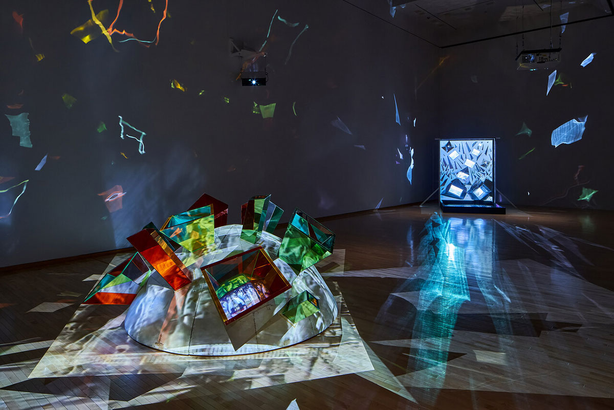
**Shigeko Kubota**, *Korean Grave* (1993); [*Women of Fluxus*](https://www.youtube.com/watch?v=DKVFX2D7JBk)

*A collection of Kubota’s works at the Mother Gallery, Beacon NY.*
> *“In her own practice Kubota purposefully eschewed the emerging vocabularies of projection and performance... Instead, Kubota doubled down on presenting video as sculpture. She explored the possibilities of melding the elemental forms, serial compositions, and industral fabrication techniques of postwar American sculptural abstraction... with the developing American feminist engagement with autobiographical video.”*
> 
>  *- Gloria Sutton, et al. "Shigeko Kubota: Liquid Reality". The Museum of Modern Art, 2021.*

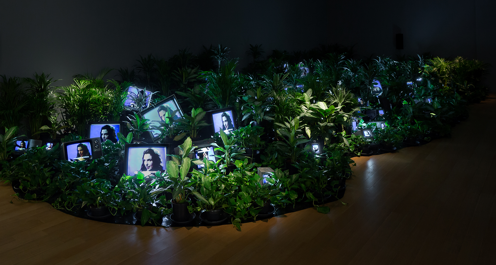
**Nam June Paik**, *TV Garden* (1974–77)

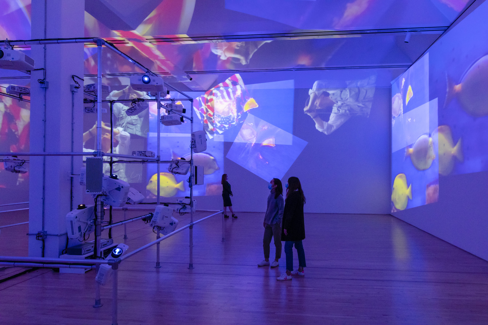
**Nam June Paik**, *Sistine Chapel* (1993)

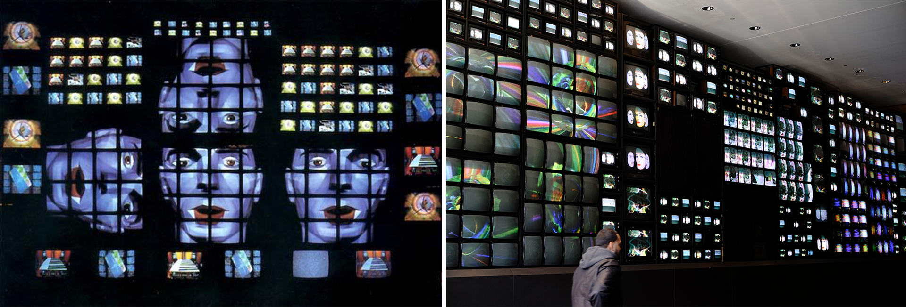
**Rebecca Allen**, *Nam June Paik Collaborations* (1989)

> *From 1989, beginning with the work Fin de Siecle II, work by Rebecca Allen was integral to a number of Nam June Paik's video installations. In addition, Paik commissioned Allen to create work for the new Chase Manhattan Bank headquarters in New York and the Taejon World Expo.* 
> 
> *[https://www.rebeccaallen.com/projects/nam-june-paik-collaborations](https://www.rebeccaallen.com/projects/nam-june-paik-collaborations)*

---

## Responsive Systems

**Camille Utterback**, *Text Rain* (1999)
> *'Text Rain' is an interactive installation in which participants use the familiar instrument of their bodies, to do what seems magical—to lift and play with falling letters that do not really exist.*
> 
> [*https://camilleutterback.com/projects/text-rain/*](https://camilleutterback.com/projects/text-rain/)

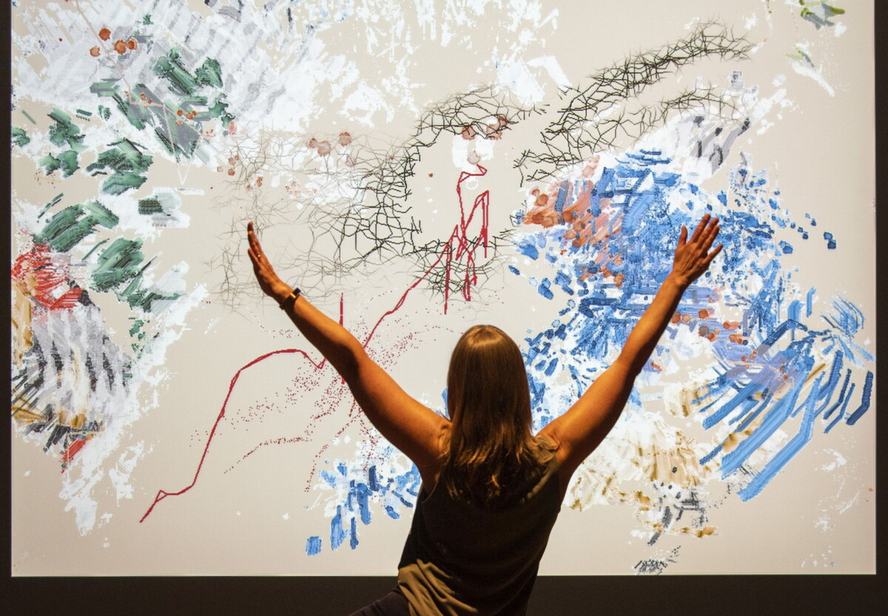
**Camille Utterback**, *Untitled 5* (2004)
> *'Untitled 5' is the fifth interactive installation in the External Measures Series, which Utterback has been developing since 2001. The goal of these works is to create an aesthetic system which responds fluidly and intriguingly to physical movement in the exhibit space. The installations respond to their environment via input from an overhead video camera. Custom video tracking and drawing software outputs a changing wall projection in response to the activities in the space. The existence, positions, and behaviors of various parts of the projected image depend entirely on people’s presence and movement in the exhibit area.*
> 
> *'Untitled 5' creates imagery that is painterly, organic, and evocative while still being completely algorithmic. To create this work, Utterback first develops sets of animated marks whose parameters and behaviors are controlled by people’s movements. Then, out of a working ‘palette’ of these animated marks, she composes an overall composition. The composition balances responses whose logic is immediately clear, with responses that feel connected to viewer’s movements, but whose logic remains complex and mysterious.*
> 
> [*https://camilleutterback.com/projects/untitled-5/*](https://camilleutterback.com/projects/untitled-5/)

**Cory Arcangel**, *elleusa, equinor, equinox, etrade_financial*, (left, 2020); */roʊˈdeɪoʊ/ Let’s Play: HOLLYWOOD*, (right, 2017-21)

> *"...a live feed of a custom computer navigating the videogame Kim Kardashian: Hollywood, using machine learning—intended to streamline performance—toward more ambivalent ends. A player’s goal in the game is to increase their fame and reputation to become an A-list celebrity, and Arcangel’s operating system fumbles its way through this ersatz version of suburban Los Angeles. The work’s layered visuals comprise the flattened graphics of the role-playing game itself, an array of colored boxes the algorithm uses to identify what it encounters, and scrolling lines of code that correspond to the program’s automated progress, with in-game sounds composed by the musician Daniel Lopatin (Oneohtrix Point Never). /roʊˈdeɪoʊ/ Let’s Play: HOLLYWOOD recalls the modified game cartridges that marked Arcangel’s early career, but the use of artificial intelligence expands the scope of those prior interventions—here the game has been repurposed in ways that even the artist does not control, and the outcome of play cannot be known in advance. The work’s hypnotic effect turns ominous if one contemplates the endless reserves of data that clutter the screen, and the urge to optimize the pursuit of fame for its own sake."*
> 
> *"...a bot has been programmed to scroll through the Twitter feeds of these corporate accounts, indiscriminately ‘liking’ every post. That blanket enthusiasm mimics the actions of click farms paid to generate fake traffic online, falsely inflating one’s popularity and corrupting the (already suspect) economy of influence."*
> 
> *Press realease: Cory Arcangel, Century 21, Greene Naftali, New York, 2021*

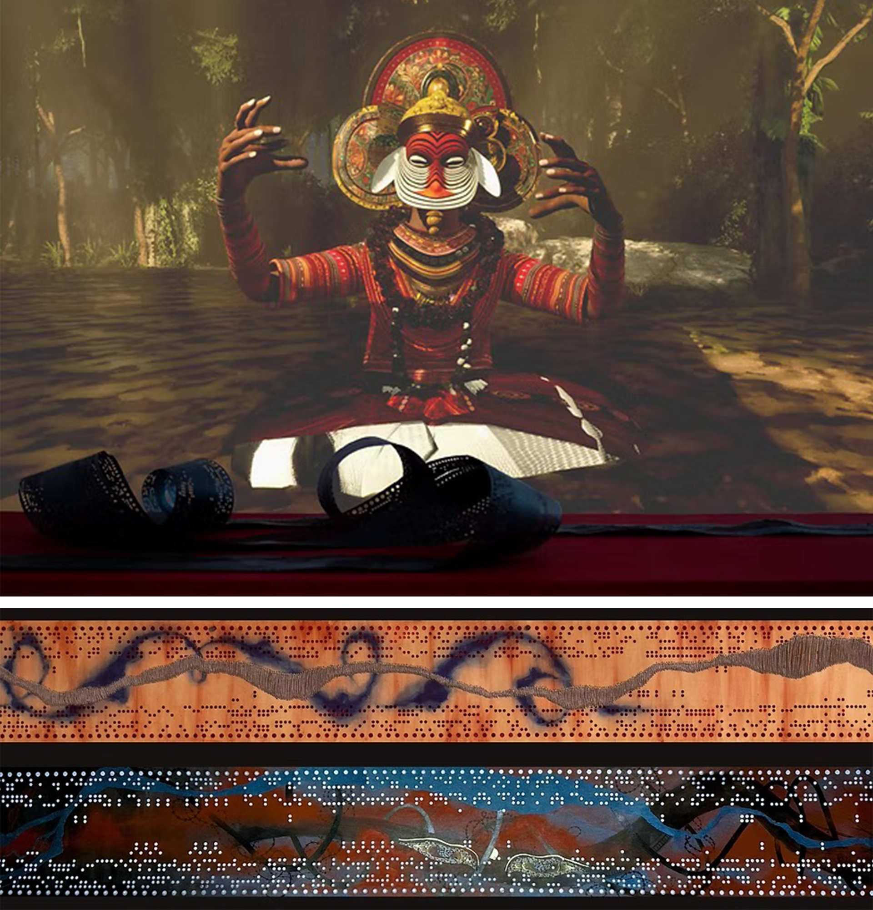
**Kinnari Saraiya**, [*In the Eye of a Dream*](https://www.kinnarisaraiya.com/intheeyeofadream) (2024)

> *In the Eye of a Dream is an immersive installation built from fragments, voices, and dreamscapes drawn from the colonial archive held at the Royal Anthropological Institute.*
> 
> *The installation dwells in this residue. It consists of two interactive chapters navigated through embroidered punch-card controllers, and a film, all set within a bespoke soundscape created with classical Indian musicians and custom instruments that mimic forests, rain, and bells.*
> 
> *The Jacquard loom, invented in France in 1804 by Joseph-Marie Jacquard, was the first weaving machine to use a system of punch cards to control patterns in fabric. Each hole or absence of a hole functioned like a binary command, allowing complex designs to be replicated with precision. This mechanisation marked a turning point: it reduced weaving from an embodied, relational craft into a programmable system, and its logic directly influenced later developments in computing, from Charles Babbage’s Analytical Engine to Ada Lovelace’s writings on algorithms.​*
> 
> *In the installation, Jacquard punch cards return in altered form as custom controllers, painted and embroidered with symbols and systems that translate touch into function within virtual worlds. They operate as archival storytelling instruments: tactile, touch-sensitive devices that bind narrative to material form.*
> 
> *[https://www.kinnarisaraiya.com/intheeyeofadream](https://www.kinnarisaraiya.com/intheeyeofadream)*

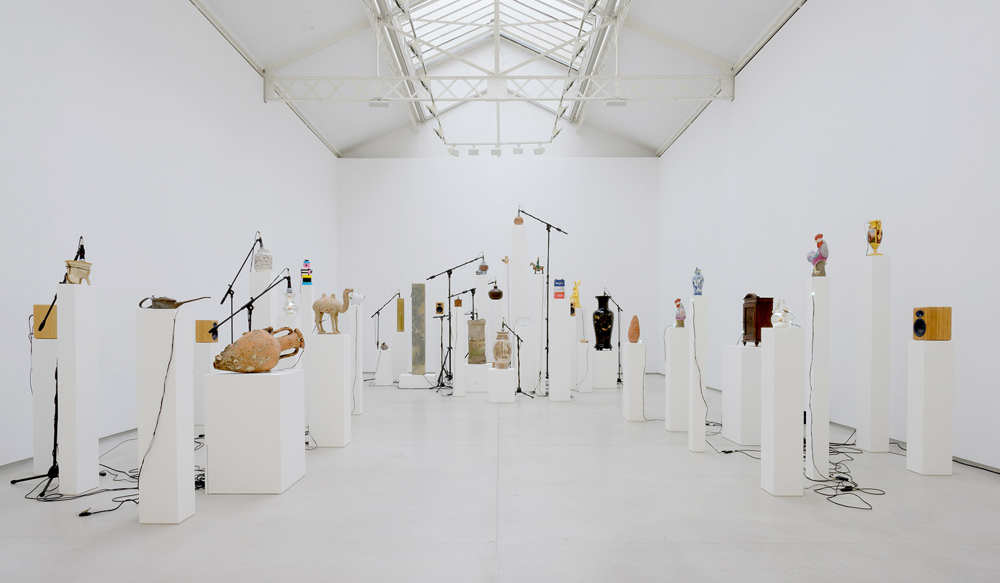
**Oliver Beer**, [*Vessel Orchestra*](https://drive.google.com/file/d/1SsUsdvy6HXphUIECr3Ol6jREBbf2mFh4/view?usp=drive_link) (2019)
> *Exhibition Overview: Composed of thirty-two sculptures, utilitarian containers, and decorative objects from the Museum's collection, Vessel Orchestra is the first sound-based installation commissioned by The Met. British artist Oliver Beer (born 1985) uses microphones and speakers to amplify and shape the ambient tones resonating within each vessel, transforming them into an arresting and unexpectedly versatile musical instrument. With objects ranging in origin from ancient Persia to modern America, this exhibition links works of art across historical periods and cultures, creating an audible portrait of The Met collection.*
> 
> *Drawing on his musical training, Beer creates artworks that reveal the hidden properties of objects, bodies, and architectural sites. His social and familial relationships often become the blueprint for multidisciplinary works that engage with both intimate and universal concerns, such as the personal and cultural meanings invested in the things we possess.*
> 
>  [*https://www.metmuseum.org/exhibitions/listings/2019/oliver-beer-vessel-orchestra*](https://www.metmuseum.org/exhibitions/listings/2019/oliver-beer-vessel-orchestra)

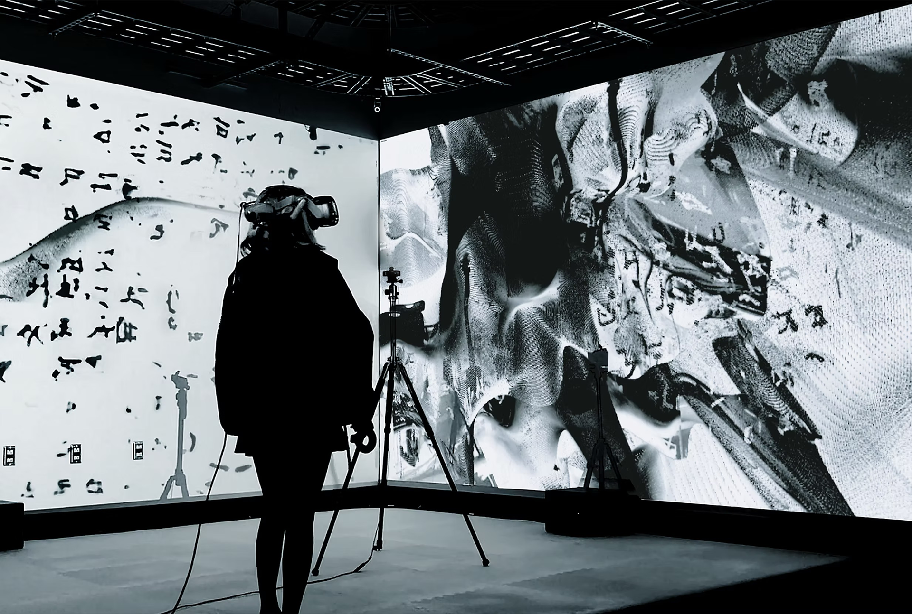
**Weidi Zhang and Donghao Ren**, [*Cangjie's Poetry*](https://www.zhangweidi.com/cangjiepoetry) (2019-20)
> *Trained on over 9,000 Chinese characters, the AI system Cangjie by Weidi Zhang and Donghao Ren is creating a new language to converse with the spectator, creating an immersive data visualization spectacle in a multi modal installation. Cangjie's Poetry tackles the issue of language creation between human and machine in a sensitive, poetic, and fragile way. Cangjie´s Poetry is an exceptional and far-reaching work bringing data visualization and the use of AI in co-creation between being and apparatus."*
> 
> [*- Prix Ars Electronica Honorary Mention*](https://www.zhangweidi.com/cangjiepoetry)

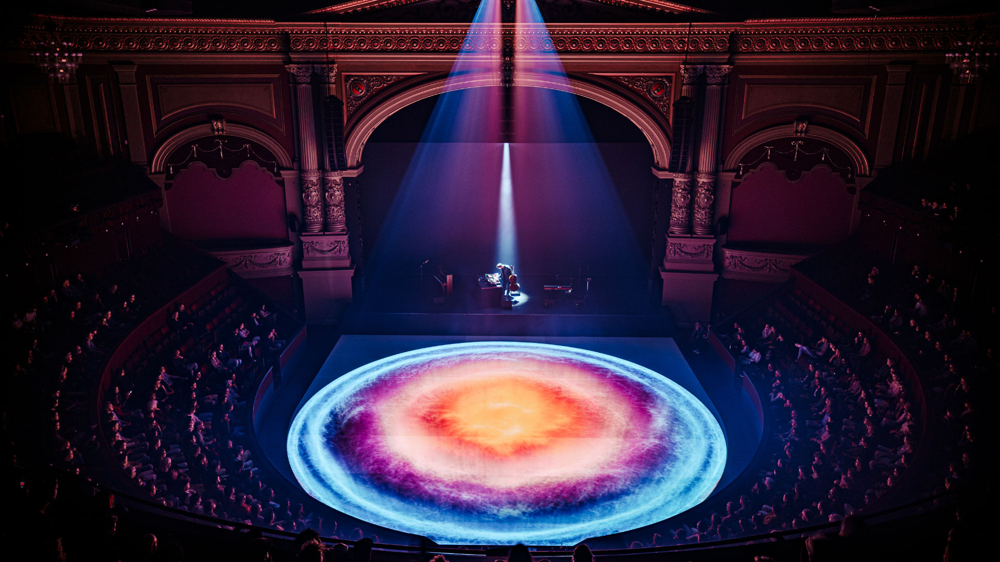
**MAOTIK**, [*Layers of Earth*](https://maotik.com/layers/) (2023)
> *Mathieu Le Sourd, also known as MAOTIK, is a French digital artist with a focus on creating immersive environments, interactive installations and audiovisual performances which play at the intersection of art, science, and technology.*
> 
> *The artist studied Digital Media Production at the London College of Communication in London and holds a Master's Degree in Digital Arts from Pompeu Fabra University in Barcelona. MAOTIK creates immersive environments using custom-designed softwares that transform perceptions of reality in real time. His approach to generative art is defined by the fluid motion of images and their seamless integration into immersive spaces. His work is inspired by nature, abstracting its essence through audiovisual sculptures based on randomness, creating unique experiences each time. He frequently involves audiences in his work, pushing the boundaries of perception with generative art, sound, algorithms, and data to envelop viewers in a fully immersive artistic experience.*
> 
> [*https://maotik.com/*](https://maotik.com/)

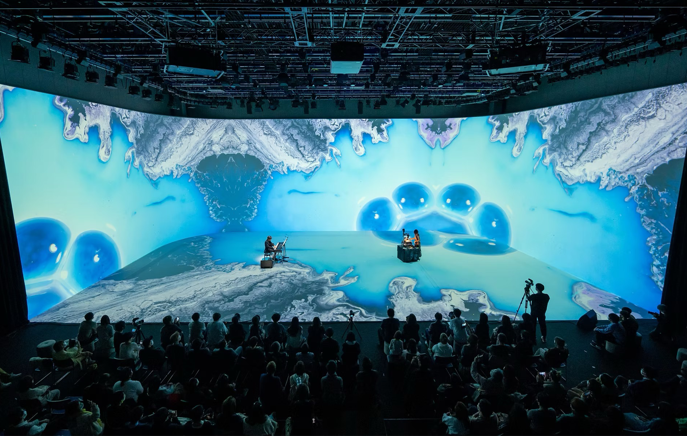
**Akiko Nakayama & Eiichi Sawado**, [*The Morphology of Freely Rising Deformable Bubbles*](https://www.youtube.com/watch?v=QYUd5pVQCBQ), *ETERNAL Art Space, Panasonic Center Tokyo Ariake Studio, Tokyo, Japan* (2022)
> *Akiko Nakayama’s 'Alive Painting' is literally a “painting that is alive.” She uses water-repellent acrylic paper, Petri dish, sand surface, and other supplies as a “landscape” and drops or pours liquified paints on them; she shares the paintings—or the views orchestrated by various paints—through live performance with the audience. The images constantly change, which makes them impossible to be replicated. Alive Painting is an artistic conflation of the two major art mediums—painting and performance—and a unique form of creative expression. Nakayama is constantly updating the style of Alive Painting, collaborating with musicians, and adding improvised poems coinciding with the visual.*
> 
> *- Masanobu Matsumoto, ["What is Alive Painting? Artist Akiko Nakayama’s Poetic Emanation of Fluidity and Colors"](https://tokion.jp/en/2022/03/29/akiko-nakayama-alive-painting/), 2022*
