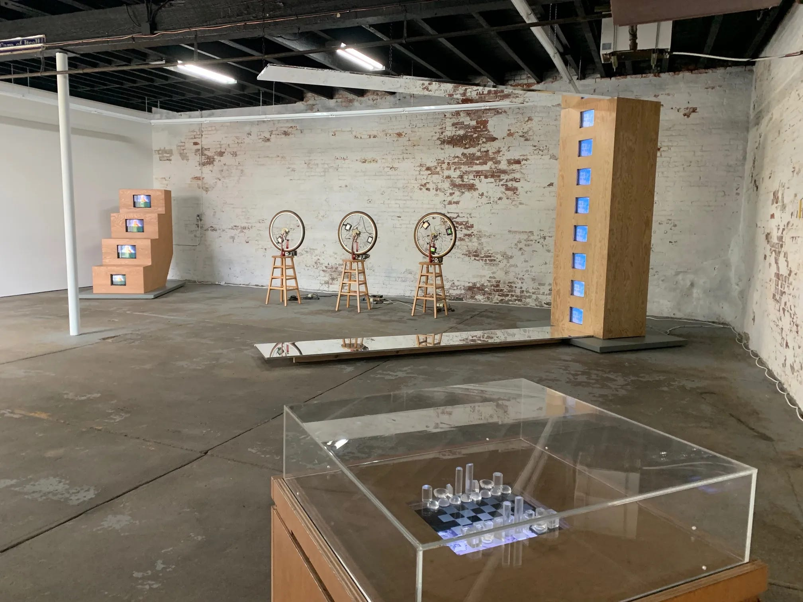
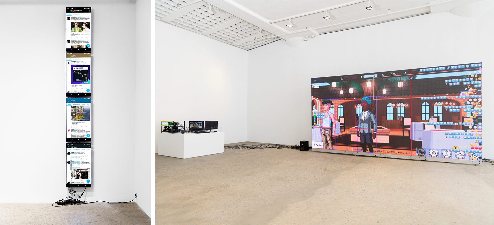

# Responsive Environments

---

## Art in Flux: Things and Events

.png)
**John Cage**, *Theater Piece no. 1* (1952)
> “I am interested in any art not as a closed-in thing by itself but as a going-out one to interpenetrate with all other things, even if they are arts too. All of these things, each one of them seen as of first importance; no one of them as more important than another. In theater, as Artaud points out, it is death to place literature in the only central position; and so I do not agree that ‘film is a visual form’. The images don’t interest me any more than the sound. Nor am I interested in the artistic arrangement of sound to go with or against the images. All that comes about in a successful such situation is a composite of two, not an imitation … of nature in her manner of operation as, in our time, her operation is revealed.” 
> 
> *John Cage — “On Film”, 1956, in John Cage: An Anthology, ed. Richard Kostelanetz (New York: Da Capo, 1991), 115. Quoted in Kay Larson’s Where the Heart Beats: John Cage, Zen Buddhism, and the Inner Life of Artists, (New York: Penguin Press, 2012), 255.*

*Declared the first happening, the performance (referred to by many as “The Event”) took place in August 1952 at Black Mountain College. Later named “Theater Piece No. 1”, it was one of John Cage's first large scale collaborative, multimedia performances, created and performed while he was teaching at Black Mountain College in North Carolina. It involved several simultaneous performance components – all orchestrated by Cage – and chance played a determining role.*

.png)
**Robert Rauschenberg**, *Erased de Kooning Drawing* (1953)

.jpg)
**George Maciunas**, *Expanded Arts Diagram* (1966)

.png)
**Yoko Ono**, *Grapefruit* (1964)

.jpg)
**Robert Rauschenberg**, *[Soundings](https://www.youtube.com/watch?v=28Cf8JnuDK4)* (1968)

, Slant Board (1961).png)
**Simone Forti**, *Slant Board* (left, 1961); *See Saw* (right, 1960)

**Sol LeWitt**, *Wall Drawing #260, On Black Walls, All Two-Part Combinations of White Arcs from Corners and Sides, and White Straight, Not-Straight, and Broken Lines* (1975)

---
## Network Aesthetics

.png)
**Stan VanDerBeek**, *[Movie Drome](https://www.youtube.com/watch?v=GUn6ssvNj9Q&t=5s)* (left, 1965); *Movie-Drome under construction, Stony Point, New York* (right, 1964)

.jpg)
**Stan VanDerBeek**, *Movie-Mural* (1965-68)

.jpeg)
**Stan VanDerBeek**, *Panels for the Walls of the World: Phase II* (1970). 

> *Panels for the Walls of the World: Phase II (1970) is a grid of 153 sheets of paper totaling six feet by twenty. It was conceived to be transmitted from MIT as individual sheets of facsimile to its exhibition destination, long before “fax” became a commonplace verb (Xerox introduced the technology in the mid-1960s with advertising copy that read “Mail Letters Over the Phone!”) and daily implement.* 

> Stephen Frailey, "Stan VanDerBeek: Transmissions", The Brooklyn Rail. April 2024

.jpg)
**Shigeko Kubota**, *Korean Grave* (1993)

*A collection of Kubota’s works at the Mother Gallery, Beacon NY.*

.jpg)
**Nam June Paik**, *TV Garden* (1974–77)

.jpg)
**Nam June Paik**, *Sistine Chapel* (1993)

.png)
**Rebecca Allen**, *Nam June Paik Collaborations* (1989)

> *From 1989, beginning with the work Fin de Siecle II, work by Rebecca Allen was integral to a number of Nam June Paik's video installations. In addition, Paik commissioned Allen to create work for the new Chase Manhattan Bank headquarters in New York and the Taejon World Expo.* 
> 
> *https://www.rebeccaallen.com/projects/nam-june-paik-collaborations*

---

## Responsive Systems

.jpg)
**Camille Utterback**, *Text Rain* (1999)

.jpg)
**Camille Utterback**, *Untitled 5* (2004)

**Cory Arcangel**, *elleusa, equinor, equinox, etrade_financial*, (left, 2020); */roʊˈdeɪoʊ/ Let’s Play: HOLLYWOOD*, (right, 2017-21)

> *"...a live feed of a custom computer navigating the videogame Kim Kardashian: Hollywood, using machine learning—intended to streamline performance—toward more ambivalent ends. A player’s goal in the game is to increase their fame and reputation to become an A-list celebrity, and Arcangel’s operating system fumbles its way through this ersatz version of suburban Los Angeles. The work’s layered visuals comprise the flattened graphics of the role-playing game itself, an array of colored boxes the algorithm uses to identify what it encounters, and scrolling lines of code that correspond to the program’s automated progress, with in-game sounds composed by the musician Daniel Lopatin (Oneohtrix Point Never). /roʊˈdeɪoʊ/ Let’s Play: HOLLYWOOD recalls the modified game cartridges that marked Arcangel’s early career, but the use of artificial intelligence expands the scope of those prior interventions—here the game has been repurposed in ways that even the artist does not control, and the outcome of play cannot be known in advance. The work’s hypnotic effect turns ominous if one contemplates the endless reserves of data that clutter the screen, and the urge to optimize the pursuit of fame for its own sake."*
> 
> *"...a bot has been programmed to scroll through the Twitter feeds of these corporate accounts, indiscriminately ‘liking’ every post. That blanket enthusiasm mimics the actions of click farms paid to generate fake traffic online, falsely inflating one’s popularity and corrupting the (already suspect) economy of influence."*
> 
> *Press realease: Cory Arcangel, Century 21, Greene Naftali, New York, 2021*

-2.jpeg)
-1.jpeg)
**Kinnari Saraiya**, [*In the Eye of a Dream*](https://www.kinnarisaraiya.com/intheeyeofadream) (2024)

> *In the Eye of a Dream is an immersive installation built from fragments, voices, and dreamscapes drawn from the colonial archive held at the Royal Anthropological Institute.*
> 
> *The installation dwells in this residue. It consists of two interactive chapters navigated through embroidered punch-card controllers, and a film, all set within a bespoke soundscape created with classical Indian musicians and custom instruments that mimic forests, rain, and bells.*
> 
> *The Jacquard loom, invented in France in 1804 by Joseph-Marie Jacquard, was the first weaving machine to use a system of punch cards to control patterns in fabric. Each hole or absence of a hole functioned like a binary command, allowing complex designs to be replicated with precision. This mechanisation marked a turning point: it reduced weaving from an embodied, relational craft into a programmable system, and its logic directly influenced later developments in computing, from Charles Babbage’s Analytical Engine to Ada Lovelace’s writings on algorithms.​*
> 
> *In the installation, Jacquard punch cards return in altered form as custom controllers, painted and embroidered with symbols and systems that translate touch into function within virtual worlds. They operate as archival storytelling instruments: tactile, touch-sensitive devices that bind narrative to material form.*
> 
> *https://www.kinnarisaraiya.com/intheeyeofadream*
